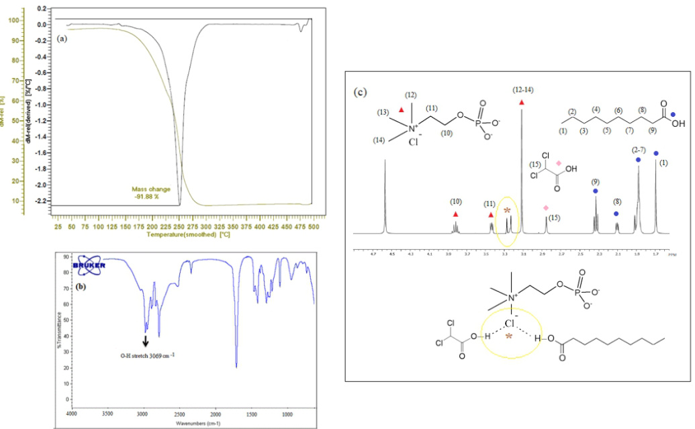
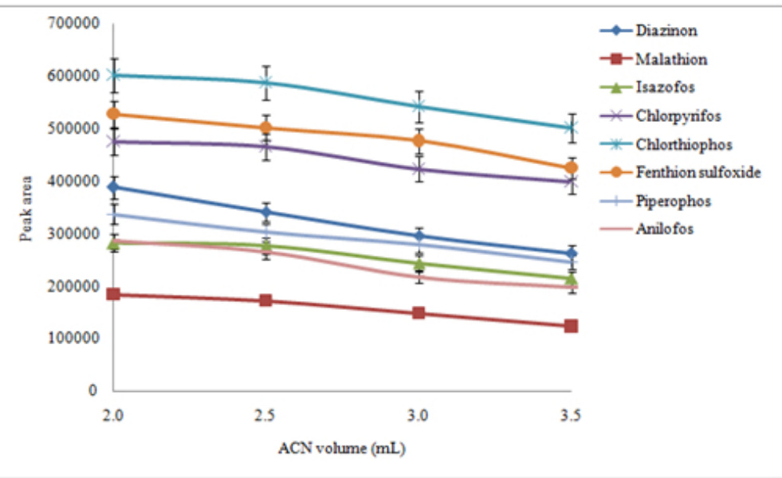
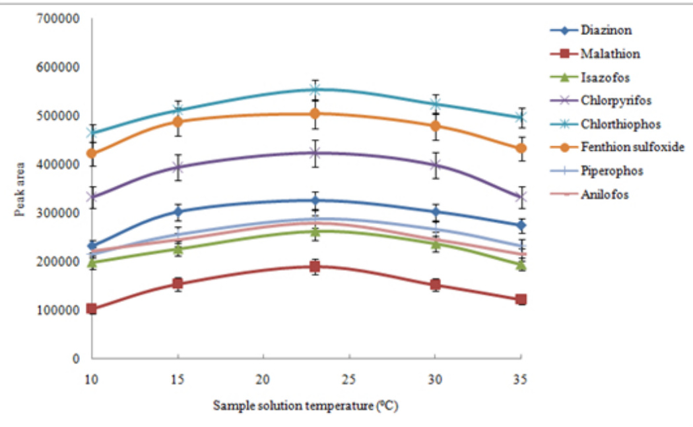
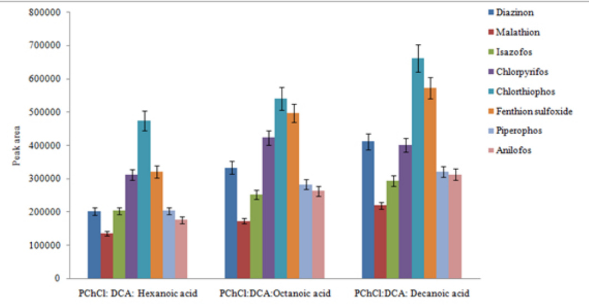
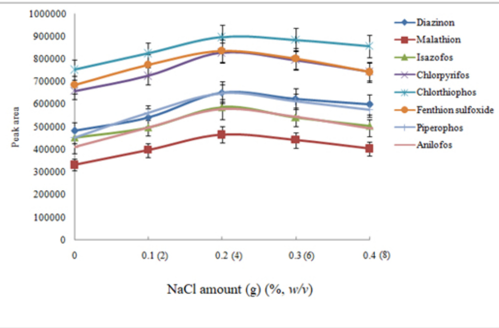
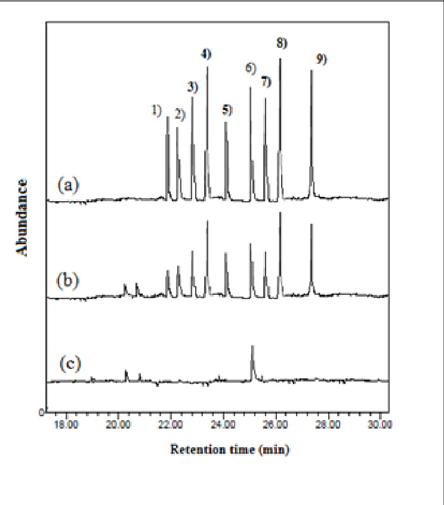

Synthesis and characterization of phosphocholine chloride-based three-component deep eutectic solvent: application in dispersive liquid-liquid microextraction for determination of organothiophosphate pesticides

Nasser Mokhtari1, Mohammadali Torbati1,\*, Mir Ali Farajzadeh2,3, Mohammad Reza Afshar Mogaddam4, \*

1 Department of Food Science and Technology, Faculty of Nutrition, Tabriz University of Medical   
Sciences, Tabriz, Iran   
2 Department of Analytical Chemistry, Faculty of Chemistry, University of Tabriz, Tabriz, Iran   
3 Engineering Faculty, Near East University, 99138 Nicosia, North Cyprus, Mersin 10, Turkey   
4 Food and Drug Safety Research Center, Tabriz University of Medical Sciences, Tabriz, Iran

\*Corresponding authors: M. Torbati, E–mail address: torbatima $@$ yahoo.com and M.R. Afshar Mogaddam, E–mail address: M.R. Afshar Mogaddam

Tel.: +98 41 33379528

Fax: +98 41 33379529

# Abbreviations:

DES, Deep eutectic solvent; DLLME, Dispersive liquid–liquid microextraction; RSD, Relative standard deviation; LR, Linear range; EF, Enrichment factor; ER, Extraction recovery; GC, Gas chromatography; MS, Mass spectrometry

# ABSTRACT

# BACKGROUND:

A new type of deep eutectic solvent based on three components using phosphate salts has been synthesized, characterized, and applied in the extraction of eight organothiophosphate pesticides from honey samples. In the present study, the deep eutectic solvent was prepared from phosphocholine choline chloride as a hydrogen bond acceptor and dichloroacetic acid and decanoic acid as hydrogen bond donors. The method consisted of two steps in which initially the analytes were extracted from the samples into a water-miscible organic solvent. In the second step, the extracted phase was mixed with the prepared deep eutectic solvent and the mixture was used in the following dispersive liquidliquid microextraction method.

# RESULTS:

The method was validated under optimal conditions, and it was found that the method has low limits of detection $( 0 . 0 5 \mathrm { - 0 . 1 0 ~ n g ~ g ^ { - 1 } ) }$ and quantification $( 0 . 1 9 { - } 0 . 3 6 \mathrm { ~ n g ~ g ^ { - 1 } } )$ , good linearity $( \mathrm { r } ^ { 2 } \ge 0 . 9 9 4 )$ , broad linearity $( 0 . 3 6 \mathrm { - } 1 0 0 0 \mathrm { n g \ g ^ { - 1 } } ,$ , and satisfactory repeatability (relative standard deviation $\leq 1 0 \%$ for intra– $( \mathrm { n } { = } 6 )$ ) and inter–day $\scriptstyle ( \mathrm { n } = 4 )$ ) precisions at a concentration of $2 { \mathrm { n g } } { \mathrm { g } } ^ { - 1 }$ of each analyte).

# CONCLUSION:

Finally, the proposed method was applied in different honey samples, and malathion was found at a concentration of $2 9 { \mathrm { n g ~ g ^ { - 1 } } }$ in one sample.

This article is protected by copyright. All rights reserved.

Keywords: Organothiophosphate pesticides; Honey; Dispersive liquid-liquid microextraction; Deep eutectic solvent; Gas chromatography

# 1. Introduction

Pesticides are represented as substances or mixtures designated for destroying and mitigating any group of pests such as insects, fungi, and herbs. 1 Some pesticides are highly toxic and non– biodegradable and persist in the environment for a very long period of time. 2 Although the pesticide usage has many benefits to agriculture, contamination of soil, food, and environment is its main disadvantage.3 Studies have shown that some pesticides have carcinogenic effects and in some cases, they disrupt the nervous system of humans even at low concentrations. 4 Throughout the world, there is growing concern about food contamination by pesticides, and determining of their residues in foods is attracting more attention among the scientists. 5 Honey is a widely used food which is produced by honeybees from the sugary secretions of plants. 6 In recent years, many investigations have shown that honey has medical benefits, especially as an antimicrobial agent, and its usage is highly recommended. 7 However, during honey harvest pesticides can be used for the treatment of plague in the hive resulting in the possible contamination of honey. On the other hand, honey is polluted with pesticides through air, water, soil, and plants that bees visit and collect nectar to produce honey. 8 The analysis of pesticides in honey samples is vital to warrant consumers’ safety and obtain information

This article is protected by copyright. All rights reserved.

about the use of pesticides in crop fields and neighborhoods. In most studies, honey is considered as a biomarker of the environment. As a result, performing an analytical method is needed for the determination of pesticides in honey samples. Up to now, different instrumental analyses consisting of gas chromatography (GC) 9 high performance liquid chromatography 10, and capillary electrophoresis 11 have been used for the determination of pesticides in honey samples. Since honey is composed of different carbohydrates, minerals, flavonoids, pigments, and organic acids, its matrix is very complex, so performing a sample preparation step before the instrumental analysis is necessary. Liquid–liquid extraction 12 and solid phase extraction 13 are the most well–known extraction methods which are used in many samples. In spite of the simplicity and easiness of these procedures, the need for large volumes of organic solvents or expensive cartridge has limited their applications in recent years. As a result, many attempts have been made to develop sample preparation methods in which the organic solvents were eliminated or used in $\mu \mathrm { L }$ –level. Therefore, solid phase microextraction 14 and liquid phase microextraction (LPME) 15, 16 methods have been and developed. LPME is based on the distribution of the analyte(s) between the sample matrix and a few microliters of a water-immiscible organic solvent 15, deep eutectic solvent (DES) 17, or ionic liquid (IL) 18. LPME is categorized into three main procedures including single drop microextraction, hollow–fiber LPME, and dispersive liquid–liquid microextraction (DLLME). DLLME is an important extraction method which is used as a sample preparation procedure in many samples. In this procedure, the analytes are transferred from sample solution into a few microliters of a water–immiscible solvent (extraction solvent) dispersed in the sample solution with the aid of a water–miscible solvent (dispersive solvent). The main advantages of DLLME are high extraction efficiency and mass transfer rate 19. The major disadvantage of traditional DLLME methods is the use of halogenated solvents as the extraction solvents which are highly toxic for human health and environment. Also, handling these solvents in the laboratory is difficult and unsafe. Therefore, relatively safe solvents such as lighter than water

This article is protected by copyright. All rights reserved.

organic solvents, ILs, and DESs were proposed as the alternative extraction solvents in DLLME. The use of DESs as possible extraction solvents in DLLME is the best choice due to their important properties like inexpensiveness, less toxicity, and low vapor pressure. DESs are synthesized via hydrogen bond formation between a hydrogen bond donor and a hydrogen bond acceptor (HBA) 20. Recently, DESs were used in DLLME method for the determination of heavy metals 21 or organic compounds. 22

In the present study, for the first time, a new three-components high density DES was synthesized based on an organophosphate salt (phosphocholine chloride, PChCl), dichloroacetic acid (DCA), and decanoic acid. The prepared DES was used as an extraction solvent for the extraction of nine organothiophosphate pesticides (OTPPs) from honey samples. The method consists of two steps. In the first step, the analytes were transferred into a water-miscible organic solvent from honey matrix while in the second step the extracted analytes were more concentrated into a few microliters of the DES to reach high enrichment factors (EFs) and sensitive limit of detection (LOD). The extracted analytes were determined using gas chromatography-mass spectrometry (GC-MS).

# 2. Materials and methods

# 2.1. Materials

The determined OTPPs including diazinon, isazofos, chlorthiophos, chloropyrifos, fenthion, malathion, fenthion sulfoxide, piperophos, and anilofos with the purity higher than $9 8 . 5 \%$ were purchased from Dr. Ehrenstorfer Company (Augsburg, Germany). PChCl, DCA, hexanoic acid, octanoic acid, decanoic acid, acetonitrile, acetone, methanol, and ethanol were obtained from Merck (Darmstadt, Germany). Milli–Q water system (Millipore, Billerica, MA, USA) was used for the preparation of deionized water. A mixture stock solution of the analytes $2 5 0 ~ \mathrm { m g ~ L ^ { - 1 } }$ , each analyte)

This article is protected by copyright. All rights reserved.

was prepared in acetonitrile. This solution was diluted daily with deionized water at appropriate ratios and was used as working standard solutions.

# 2.2. Apparatus

A gas chromatograph (6890N Agilent Technologies, CA, USA) coupled with a mass–selective detector (5973, Agilent Technologies) was used for the determination of the analytes. An HP–5 MS (Hewlett–Packard, Santa Clara, USA) fused silica capillary column $3 0 ~ \mathrm { m } \times 0 . 2 5 ~ \mathrm { m m }$ i.d., and 0.25 $\mu \mathrm { m }$ film thicknesses) was used to separate the analytes in temperature programming mode. The column oven was initially maintained at $1 2 0 ^ { \circ } \mathrm { C }$ for $5 \mathrm { m i n }$ and then ramped at $1 0 \ ^ { \circ } \mathrm { C } \ \mathrm { m i n } ^ { - 1 }$ to $3 0 0 ^ { \circ } \mathrm { C }$ and was held at $3 0 0 ^ { \circ } \mathrm { C }$ for $5 \mathrm { m i n }$ . Helium $( 9 9 . 9 9 9 9 \%$ , Gulf Cryo, United Arab Emirates) was used as the carrier gas at a constant flow rate of $1 \ \mathrm { m L } \ \mathrm { m i n } ^ { - 1 }$ . Infrared spectrum was recorded using Fourier trans-form infrared spectrometer (FTIR) (Tensor 27, Bruker, Germany). Thermogravimetric analysis (TGA) was performed by Linseis, L81-A 1750 (Robbinsville, USA) under 5 mL min -1 nitrogen flow, at the temperature range of 30–600 ⁰C and the heating rate of 10 ⁰C min -1. Proton Nuclear Magnetic Resonance (1HNMR 400 MHz, DMSO-d6) spectrum was obtained using a Bruker spectrometer. Chemical shifts were reported as δ (ppm). pH measurements were carried out with a Metrohm pH meter model 654 (Herisau, Switzerland). A vortex L46 (Labinco, Breda,The Netherlands) was used for vortexing. To accelerate phase separation, a D–7200 Hettich centrifuge (Kirchlengern, Germany) was employed. The MS operational conditions were: electron ionization at $7 0 ~ \mathrm { e V }$ , ionic source temperature: $2 5 0 ~ \bigsqcup \mathrm { C }$ ; transfer line temperature: 260 ⁰C; mass range: $\mathrm { ~ m ~ } / \mathrm { ~ z ~ } 5 5 -$ 450; acquisition rate: $2 0 ~ \mathrm { H z }$ ; and detector voltage: –1700 V. Library search was performed using the commercial NIST library. For quantitative purposes, the following ions were selected: m/z 138, 179, and 182 for diazinon; m/z 97, 181, and 126 for isazofos; m/z 97, 268, and 327 for chlorthiophos; $\mathrm { m } / \mathrm { z }$ 97, 236, and 325 for chloropyrifos; m/z 109, 127, and 285 for fenthion; m/z 95, 123, and 173 for

This article is protected by copyright. All rights reserved.

malathion; m/z 109, 125, and 278 for fenthion sulfoxide; $\mathrm { m } / \mathrm { z }$ 122, 140, and 321 for piperophos; and m/z 129, 246, and 365 for anilofos. The bolded $\mathrm { m } / \mathrm { z }$ belongs to the basic ion of the analyte.

# 2.3. Real samples

Seven packed honey samples were randomly purchased from local markets at Khoy city (West Azarbaijan, Iran). Also, three honey samples were directly purchased from beekeepers of Aghbolagh village (Khoy, West Azarbaijan, Iran). No pretreatment was done on them. Also, one honey sample obtained from beekeepers of Orin Mountain at northwest of Khoy which was completely far away from the agricultural regions, was used as a pesticides free sample (blank honey) in optimization step. All the samples were diluted with de-ionized water at a ratio of 1:2 to decrease the viscosity of the honey before analysis.

# 2.4. Preparation and characterization of DES

The DES was simply synthesized by mixing and heating PChCl, DCA, and decanoic acid at a molar ratio of 1:1:1 in a glass test tube. For this purpose, $3 . 2 9 \mathrm { g }$ PChCl, ${ 8 2 7 \mu \mathrm { L } }$ of DCA and $1 . 7 2 { \mathrm { ~ g ~ } }$ decanoic acid were transferred into a $1 0 \mathrm { - m L }$ glass test tube, and the tube was capped. After vortexing the mixture for $5 \ \mathrm { m i n }$ , the tube was transferred into a water bath adjusted at $5 5 ~ \bigsqcup \mathrm { C }$ for $1 5 ~ \mathrm { m i n }$ . The obtained homogeneous solution was washed twice with deionized water before being used in DLLME procedure.

The characterization of the synthesized DES was performed by analyzing the formed DES with TGA, FT-IR, and HNMR. As can be seen from the thermogram of TGA in Fig. 1a, significant mass loss occurred at $2 5 0 \boxed { \div } \mathrm { C }$ related to the evaporation of the formed DES without mass losses at $1 9 4 \boxed { \div } \mathrm { C }$ (b.p. of DCA) or 269 ⁰C (b.p. of decanoic acid).  The FT-IR spectrum (Fig. 1b) shows that the wavelength number of the OH group relating to its stretching vibration in the synthesized DES was in $3 0 6 9 \mathrm { c m } ^ { - 1 }$ ,

This article is protected by copyright. All rights reserved.

which is different from the stretching vibration of OH group in DCA $( 3 4 2 6 ~ \mathrm { c m ^ { - 1 } } ^ { \cdot }$ ) and decanoic acid $( 2 9 4 6 ~ \mathrm { c m ^ { - 1 } } ,$ ). On the other hand HNMR spectrum of the prepared DES and the related descriptions were shown in Fig. 1c. The viscosity and density of the prepared DES at $2 0 \boxed { \square } \mathrm { C }$ were $1 . 2 7 \ \mathrm { g \ m L ^ { - 1 } }$ and $2 . 7 9 \mathrm { m P a } \mathrm { ~ s ~ }$ , respectively. These values show that the DES after DLLME procedure is collected at the bottom of the tube, and the viscosity of the DES is relatively low.

Fig. 1

# 2.5. Extraction procedure of the analytes

$2 . 0 ~ \mathrm { m L }$ of the diluted blank honey spiked with the analytes at a concentration of $2 5 ~ \mathrm { { n g } ~ g ^ { - 1 } }$ (each analyte) or unspiked samples was transferred into a $1 0 \mathrm { - m L }$ glass test tube, and $2 . 0 \mathrm { m L }$ acetonitrile was added. The mixture was vortexed for 5 min to complete the dispersion of acetonitrile into the solution. The emulsified mixture was centrifuged for 7 min at $7 0 0 0 ~ \mathrm { r p m }$ , and acetonitrile was separated from the solution and collected on top of the solution. All of the collected phase ( $\mathrm { 1 . 3 ~ m L }$ ) was removed and used as a disperser solvent in the next DLLME.

DLLME procedure was performed by mixing $1 . 3 ~ \mathrm { m L }$ of acetonitrile obtained from the pervious step with $6 0 ~ \mu \mathrm { L }$ of the DES prepared from PChCl: DCA: decanoic acid (as an extraction solvent) and dispersing the mixture into 5.0 mL NaCl solution $( 4 \% , w / \nu )$ placed in a $1 0 \mathrm { - m L }$ conical glass test tube through a 2-mL syringe. The cloudy state formed from the dispersion of the DES in the NaCl solution was centrifuged for $5 \ \mathrm { m i n }$ at $4 0 0 0 ~ \mathrm { r p m }$ to separate the extraction solvent. Finally, $1 ~ \mu \mathrm { L }$ of the sedimented phase was injected into GC-MS for analysis.

# 2.6. Calculation of EF and extraction recovery (ER)

EF and ER are two important parameters for evaluating the proposed method. EF is defined as the ratio of the analyte concentration in the sedimented phase (CDES) to the initial concentration of the analyte $\left( \mathbf { C } _ { 0 } \right)$ in the sample:

This article is protected by copyright. All rights reserved.

$$
\mathrm { E F } = \frac { \mathrm { C _ { D E S } } } { \mathrm { C _ { 0 } } }
$$

where $\mathrm { V _ { D E S } }$ and $\mathrm { \Delta V _ { a q } }$ show the volumes of the final DES and the aqueous solution, respectively. The ERs were obtained by calculating the percentage of the total amount of the analyte which was transferred into the final DES phase.

$$
\begin{array} { r } { \mathrm { E R } \ \mathcal { V } _ { O } = \frac { n _ { D E S } } { n _ { 0 } } \times 1 0 0 = \frac { C _ { D E S \times V _ { D E S } } } { C _ { 0 } \times V _ { a q } } \times 1 0 0 \ } \end{array}
$$

# 3. Results and discussion

3.1. Optimization of the related parameters in the extraction of the analytes from honey

3.1.1. Selection of extraction solvent type and volume

In the present work, the analytes were first extracted from the honey sample into a water-miscible organic solvent, which would act as a dispersive solvent in the next DLLME step. It was important that the extraction solvent should have capability to extract the analytes from honey and forms a twophase system after centrifugation. Since honey contains different carbohydrates and considering the fact that carbohydrates are classified as polyols, there were efficient interactions between the deionized water and honey carbohydrates which led to the separation of the organic solvent from the honey matrix. In fact, the honey carbohydrates acted as drawing agents towards the organic solvent. To study the extraction solvent kind, different water-miscible organic solvents (acetonitrile, acetone, methanol, and ethanol) were tested, and the results showed that only acetonitrile formed a two-phase system, it was chosen for the next studies.

The other important parameter was the volume of acetonitrile, which affected the extraction efficiency of the method. To evaluate this parameter, acetonitrile volume was changed in the range of 2.0-3.5 mL at $0 . 5 ~ \mathrm { m L }$ intervals while the other experimental conditions were kept constant. It was noted that the volume of the separated acetonitrile volume altered from 1.3 to $2 . 2 \mathrm { m L }$ . In all cases, $1 . 5 ~ \mathrm { m L }$ of the separated phase was used in the followed DLLME procedure. The results in Fig. 2 show that the

This article is protected by copyright. All rights reserved.

highest analytical signals were obtained for the analytes when the acetonitrile volume was $2 . 0 ~ \mathrm { m L }$ . It is remarkable that at volumes less than $2 . 0 ~ \mathrm { m L }$ the collected phase volume was less than $1 . 0 ~ \mathrm { m L }$ and the extraction solvent in DLLME was not dispersed sufficiently. Therefore, $2 . 0 \mathrm { m L }$ of acetonitrile was chosen for the next experiments.

# Fig. 2

# 3.1.2. Optimization of vortexing time

Vortexing has an important role in transferring the analytes into the extraction solvent (acetonitrile) and assists in better dispersion of acetonitrile in the sample solution. As a result, the vortexing time can affect the efficiency of the method. To study this parameter, a series of sample solutions was prepared using the vortex time of 3, 5, 7, and $1 0 ~ \mathrm { { m i n } }$ . The results showed that the analytical signals were relatively constant for the analytes in all the tested vortex times except for malathion, in which the peak area increased up to $5 \ \mathrm { m i n }$ and then remained nearly constant. It is remarkable that at vortexing times lower than $3 \ \mathrm { m i n }$ , acetonitrile was not separated from the sample solution after centrifugation. Therefore, 5 min was selected for the next experiments.

# 3.1.3. Optimization of sample solution temperature

Temperature can alter the distribution coefficients of the analytes and affects the extraction efficiency of the method. On the other hand, the viscosity of the diluted honey samples decreases with the increase in temperature. To evaluate the effect of sample solution temperature on the efficiency of the method, different experiments were performed by adjusting the temperature to 10, 15, 23 (room temperature), 30, and 35 ⁰C. The experiments showed that acetonitrile was not separated from the sample solution at temperatures higher than $3 5 \ \bigsqcup \mathrm { C }$ , and the method failed to work. It is noteworthy that acetonitrile volume decreased from 1.9 to $0 . 9 { \mathrm { ~ m L } }$ by increasing the temperature of the sample from 10 to 35 ⁰C. In all cases, $1 . 3 ~ \mathrm { m L }$ of the collected acetonitrile was used in the followed DLLME

This article is protected by copyright. All rights reserved.

procedure, and when the acetonitrile volume was lower than $1 . 3 ~ \mathrm { m L }$ , it was diluted to $1 . 3 ~ \mathrm { m L }$ with pure acetonitrile. According to the obtained results in Fig. 3, analytical signals increase up to room temperature and then decrease. Subsequently, the method was performed at room temperature.

Fig. 3

# 3.2. Optimization of the related parameters in DLLME

# 3.2.1. Selection of the extraction solvent type in DLLME

Extraction solvent type has a vital effect on the performance of DLLME procedure, and different DESs have already been tested as possible extraction solvents. In the present study, the tested DESs needed to have several characteristics such as suitable vapor pressure, extraction capability of the analytes, higher density than water, and low solubility in aqueous phase. Among these factors, the vapor pressure of the DES had to be considered to avoid contamination of the ionic source of MS and injection port of the GC. The effect of extraction solvent type on the efficiency of the method was evaluated by performing different experiments using three DESs consisting of PChCl: DCA: hexanoic acid (m.p. 9 ⁰C), PChCl: DCA: octanoic acid (m.p. 13⁰C), and PChCl: DCA: decanoic acid (m.p. 16⁰C). To obtain comparable results, different volumes of each solvent were subjected to the same procedure, and in all cases $1 0 ~ \mu \mathrm { L }$ of each solvent was collected at the bottom of the tube. For this purpose, $8 3 ~ \mu \mathrm { L }$ of PChCl: DCA: hexanoic acid, $7 5 ~ \mu \mathrm { L }$ of PChCl: DCA: octanoic acid, and $6 8 ~ \mu \mathrm { L }$ of PChCl: DCA: decanoic acid were mixed with $1 . 3 ~ \mathrm { m L }$ acetonitrile phase obtained from the pervious step. Figure 4 shows the obtained analytical signals for the analytes. According to these results, PChCl: DCA: decanoic acid has the best efficiency for the extraction of the analytes among the tested solvents. Therefore, it was selected for the next experiments.

# 3.2.2. Salt addition

This article is protected by copyright. All rights reserved.

In DLLME step, addition of NaCl to deionized water decreases the solubility of the analytes. Decreasing the solubility of the analytes can enhance the efficiency of the method by increasing transfer of the analytes into the extraction solvent. To study the salt addition effect, different amounts of NaCl in the range of $0 { - } 0 . 4 \mathrm { ~ g ~ } ( 0 { - } 8 \% , \ : w / \nu )$ were separately added to the deionized water, and the method was performed on them. To reach the same sedimented phase volume, different volumes of the extraction solvent including 68, 63, 60, 56, and ${ 5 2 \mu \mathrm { L } }$ were used when 0, 0.1, 0.2, 0.3, and $0 . 4 ~ \mathrm { g }$ NaCl was added to the deionized water, respectively. The obtained results in Fig. 5 showed that the efficiency of the method increases up to $0 . 2 \mathrm { ~ g ~ } ( 4 \% , w / \nu )$ and then decreases, gradually. Decrease in the efficiency of the method at high amounts of NaCl (higher than $\begin{array} { r } { 0 . 2 \ \mathrm { g } \ ' } \end{array}$ ) can be attributed to the increase in deionized water viscosity, which leads to the decrease in distribution coefficients of the analytes. As a result, $0 . 2 \mathrm { ~ g ~ } ( 4 \% , w / \nu )$ of NaCl was added in the next experiments.

Fig. 5

# 3.2.3. Optimization of extraction solvent volume

Performing the DLLME procedure at different volumes of the extraction solvent can result in different data due to the difference in the volume ratio of the phases (extractive phase and aqueous phase). The change in the volume ratio of the phases can influence ERs and EFs of the method. In this work, the initial volume of the extraction solvent (PChCl: DCA: decanoic acid) was changed in the range of $6 0 { \cdot } 1 0 0 ~ \mu \mathrm { L }$ , and the results (data not shown here) showed that the ERs for all the analytes were nearly constant, while the EFs decreased due to the increase in the final volume of the sedimented phase. The final sedimented phase volume altered in the range of $1 0 – 4 3 ~ \mu \mathrm { L }$ . To reach the low LODs and high EFs, the extraction solvent volume was fixed at $6 0 ~ \mu \mathrm { L }$ for the next experiments.

This article is protected by copyright. All rights reserved.

Sample solution and deionized water $\mathrm { \ p H }$ can affect the efficiency of the method. The data in the literature show that OTPPs are hydrolyzed in strongly alkaline or acidic pHs [20] and that they are not stable at these pHs. Therefore, optimization of the sample or deionized water pH was studied in the range of 2-12 by adding suitable volumes of 0.1 M HCl or NaOH solutions. The results showed that the analytical signals were nearly constant at $\mathrm { \ p H \ 4 } – 8$ , while the analytes extraction efficiency decreased in other pHs. Since pHs of honey and deionized water were in the range of 4-8, there was no need for pH adjustment in this study.

# 3.4. Method validation

Important analytical parameters including LOD, limit of quantification (LOQ), intra– and inter–day precisions, linear range (LR), ER, and EF were calculated for the developed method under final conditions, and the data are summarized in Table 1. Wide LRs with a coefficient of determination $\geq$ 0.994 were obtained for all the analytes. The LODs and LOQs, calculated as the signal–to–noise (S/N) ratios of 3 and 10, were in the ranges of 0.05–0.10 and $0 . 1 9 { - } 0 . 3 6 ~ \mathrm { n g ~ m L ^ { - 1 } }$ , respectively. The ERs and EFs for the analytes were obtained in the range of $8 2 - 9 8 \%$ and 82-98, respectively. The precision of the proposed method, expressed as relative standard deviation $( \mathrm { R S D \% } )$ , was studied by analyzing standard solutions at the concentration of $2 ~ \mathrm { n g ~ m L ^ { - 1 } }$ of each analyte on the same day $\scriptstyle ( \mathrm { n = 6 } )$ and four different days. The $R S D s \%$ were in the ranges of 4–8 and $5 \mathrm { - } 1 0 \%$ for intra– and inter–day precisions, respectively. These results confirm that the proposed procedure can be used for the determination of the studied pesticides at trace levels.

Table 1

# 3.5. Real samples analysis

The developed method was performed on different honey samples obtained from different brands and regions. The developed method was performed on them and the obtained chromatograms indicated

This article is protected by copyright. All rights reserved.

that all of the samples were free of the analytes except one sample in which malathion was determined at a concentration of $2 9 { \mathrm { ~ n g ~ g ^ { - 1 } } }$ . Typical GC–selected ions monitoring (SIM)–MS chromatograms of un–spiked and spiked honey samples after performing the developed method, along with the chromatogram of directly injected standard solution at a concentration of $1 0 ~ \mathrm { { m g } ~ L ^ { - 1 } }$ (each pesticide) are shown in Fig. 6. To study the matrix effect of the selected samples, the added–found method was employed. For this purpose, seven of the samples were spiked at three concentration levels (10, 25, and $5 0 ~ \mathrm { { n g } ~ g ^ { - 1 } }$ of each pesticide) and the developed method was performed on them. The obtained concentrations in the spiked samples were divided to the added concentration, and the obtained ratios were multiplied by 100 to calculate extraction recoveries. They are listed in Table 2. The obtained results reveal that the matrices of the samples have no significant effect on the performance of the proposed method.

# Fig. 6

Table 2

# 3.6. Comparison of the method with other approaches

Table 3 shows LOD, LR, and RSD values of the present work and other previously reported methods in the determination of the analytes. Among these values, the LODs of the method are lower than those of the compared procedures. The precision of the method is good and the ${ \mathrm { R S D } } \%$ values in the present work are comparable with the other methods. According to the results, the proposed method is a rapid, sensitive, and repeatable technique that can be used for the extraction/preconcentration and determination of the target analytes in honey samples.

Table 3

# 4. Conclusion

In the present research, for the first time, a new three-component DES–based DLLME using an organophosphate salt was used for the extraction and preconcentration of some OTPP residues in

This article is protected by copyright. All rights reserved.

honey samples before their determination by GC–MS. For this purpose, PChCl, DCA, and decanoic acid were used in preparation of the DES was used in the preparation of DES and it was used as extraction solvent in microextraction procedure. In this method, the analytes were firstly extracted into a water-miscible organic solvent (acetonitrile) and it was used as dispersive solvent in the followed DLLME. Rapidity, simplicity, and low cost are the other advantages of the proposed method. The developed method was superior to literature values with respect to analytical features. Overall, the obtained results (low LODs and LOQs, good repeatability, and high ERs) suggest that the proposed method can be reliably used as a routine analytical method for the analysis of the selected OTPPs in honey samples.

Table 3

# 4. Conclusion

In the present research, a new three-components DES–based DLLME was used for the extraction and preconcentration of some OTPP residues in honey samples before their determination by GC–MS. An organophosphate salt was used for the first time in the preparation of DES. Rapidity, simplicity, and low cost are the other advantages of the proposed method. Overall, the obtained results (low LODs and LOQs, good repeatability, and high ERs) suggest that the proposed method can be reliably used as a routine analytical method for the analysis of the selected OTPPs in honey samples.

# Acknowledgment

The authors thank the Research Council of Tabriz University of Medical Sciences for financial support.

# Conflict of Interest

The authors declare that they have no conflict of interest.

This article is protected by copyright. All rights reserved.

# References

1. Rajski Ł, Jesús Martínez-Bueno M, Ferrer C and Fernández-Alba AR, LC-ESI-QOrbitrap™ MS/MS within pesticide residue analysis in fruits and vegetables. Trends Anal. Chem. 118: 587-596 (2019).   
2. Bian Y, Liu F, Chen F and Sun P, Storage stability of three organophosphorus pesticides on cucumber samples for analysis. Food Chem. 250: 230-235 (2018).   
3. Parrilla Vázquez P, Ferrer C, Martínez Bueno MJ and Fernández-Alba AR, Pesticide residues in spices and herbs: Sample preparation methods and determination by chromatographic techniques. Trends Anal. Chem. 115: 13-22 (2019).   
4. Akoto O, Oppong-Otoo J and Osei-Fosu P, Carcinogenic and non-carcinogenic risk of organochlorine pesticide residues in processed cereal-based complementary foods for infants and young children in Ghana. Chemosphere 132: 193-199 (2015).   
5. Drabova L, Alvarez-Rivera G, Suchanova M, Schusterova D and Hajslova J, Food fraud in oregano: Pesticide residues as adulteration markers. Food Chem. 276: 726-734 (2019).   
6. Wei Se K, Abdul Wahab R, Nuratiqah Syed Yaacob S, Krishna Ghoshal S, Detection techniques for adulterants in honey: Challenges and recent trends. J. Food Com. Anal. 80: 16-32 (2019).   
7. Pang GF, Fan CL, Liu YM, Cao YZ, Zhang JJ, Fu BL, Li XM, Li ZY and Wu YP, Multi-residue method for the determination of 450 pesticide residues in honey, fruit juice and wine by doublecartridge solid-phase extraction/gas chromatography-mass spectrometry and liquid chromatography-tandem mass spectrometry. Food Addit Contam. 23: 777-810 (2006).   
8. Gaweł M, Kiljanek T, Niewiadowska A, Semeniuk S and Posyniak A, Determination of neonicotinoids and 199 other pesticide residues in honey by liquid and gas chromatography coupled with tandem mass spectrometry. Food Chem. 282: 34-47 (2019).

This article is protected by copyright. All rights reserved.

9. Arroyo-Manzanares, M. García-Nicolás, A. Castell, N. Campillo, M. Hernández-Córdoba, Untargeted headspace gas chromatography – Ion mobility spectrometry analysis for detection of adulterated honey. Talanta 205: 120123 (2019). Article In press.   
10. Valverde S, Ibáñez M, Bernal J.L, Nozal MJ and Bernal J, Development and validation of ultra high performance-liquid chromatography–tandem mass spectrometry based methods for the determination of neonicotinoid insecticides in honey. Food Chem. 266: 215-222 (2018).   
11. Irungu J, Raina S, and Torto B, Determination of pesticide residues in honey: a preliminary study from two of Africa’s largest honey producers. Int. J. Food Contam. 3: 14-19 (2016).   
12. Tighrine A, Amir Y, Alfaro P, Mamou M and Nerín C, Simultaneous extraction and analysis of preservatives and artificial sweeteners in juices by salting out liquid–liquid extraction method prior to ultra–high performance liquid chromatography. Food Chem. 277: 586–594 (2019).   
13. Sun X, Wang M, Peng J, Yang L and Chen J, Dummy molecularly imprinted solid phase extraction of climbazole from environmental water samples. Talanta 196: 47–53 (2019).   
14. Kataoka H, Lord HL and Pawliszyn J, Applications of solid–phase microextraction in food analysis. J. Chromatogr. A 880: 35–62 (2000).   
15. Hu L, In situ metathesis reaction combined with liquid–phase microextraction based on the solidification of sedimentary ionic liquids for the determination of pyrethroid insecticides in water samples. Talanta 144: 98–104 (2015).   
16. Yilmaz E, Soylak M, Latest trends, green aspects, and innovations in liquid-phase based microextraction techniques: a review. Turk. J, Chem. 40: 868-893 (2016).   
17. Ferrone V, Genovese S, Carlucci M, Tiecco M and Taddeo VA, A green deep eutectic solvent dispersive liquid–liquid micro–extraction (DES–DLLME) for the UHPLC–PDA determination of oxyprenylated phenylpropanoids in olive, soy, peanuts, corn, and sunflower oil. Food Chem.   
245: 578–585 (2018).

This article is protected by copyright. All rights reserved.

18. Farajzadeh MA, Bamorowat M and Afshar Mogaddam MR, Ringer tablet–based ionic liquid phase microextraction: Application in extraction and preconcentration of neonicotinoid insecticides from fruit juice and vegetable samples. Talanta 160: 211–216 (2016).   
19. Rezaee M, Assadi Y, Milani Hosseini MR, Aghaee E, Ahmadi F and Berijani S, Determination of organic compounds in water using dispersive liquid–liquid microextraction. J. Chromatogr. A   
1116: 1–9 (2006).   
20. Achkar T El, Fourmentin S and Greige-Gerges H, Deep eutectic solvents: An overview on their interactions with water and biochemical compounds. J. Mol. Liq. 288 Article 111028 (2019).   
21. Arain MB; Yilmaz E, Soylak M, Deep eutectic solvent based ultrasonic assisted liquid phase microextraction for the FAAS determination of cobalt. J. Mol. Liq. 224: 538-543 (2016).   
22. Aydin F, Yilmaz E, Soylak M, A simple and novel deep eutectic solvent based ultrasound-assisted emulsification liquid phase microextraction method for malachite green in farmed and ornamental aquarium fish water samples. Microchim. J. 132:280-285 (2017).   
23. Aly OA and Badawy MI, Hydrolysis of organophosphate insecticides in aqueous media. Environ. Inter. 7: 373-377 (1982).   
24. Asensio-Ramos M, Hern´andez-Borges J, Ravelo-Perez LM, Afonso MM,  Palenzuela, JA and Angel MA, Dispersive liquid–liquid microextraction of pesticides and metabolites from soils using 1,3-dipentylimidazolium hexafluorophosphate ionic liquid as an alternative extraction solvent. Electrophoresis 33: 1449–1457 (2012).   
25. Szarka A, Turková D and Hrouzková S, Dispersive liquid-liquid microextraction followed by gas chromatography–mass spectrometry for the determination of pesticide residues in nutraceutical drops. J. Chromatogr. A 1570: 126-134 (2018).

This article is protected by copyright. All rights reserved.

26. Li JW, Wang YL, Yan S, Li XJ and Pan SY, Molecularly imprinted calixarene fiber for solidphase microextraction of four organophosphorous pesticides in fruits. Food Chem. 192: 260-267 (2016).

# Figure captions:

Fig. 1. (a) TGA thermogram, (b) FT-IR spectrum and (c) HNMR spectrum of the prepared DES.

Fig. 2. Optimization of acetonitrile volume.

Extraction conditions: sample, $\mathrm { ~ 1 ~ g ~ }$ blank honey spiked with the pesticides ( $( 2 5 ~ \mathrm { { n g } ~ g ^ { - 1 } }$ , each analyte); vortex time, $5 \mathrm { \ m i n }$ ; and sample solution temperature, $2 0 ~ \bigsqcup \mathrm { C }$ . DLLME stage: aqueous phase, deionized water $\langle 5 \ \mathrm { m L } \rangle$ ; extraction solvent (volume), PChCl: DCA: decanoic acid DES $( 6 8 ~ \mu \mathrm { L } )$ ; centrifugation time, $5 \mathrm { m i n }$ ; and centrifugation speed, $4 0 0 0 \mathrm { r p m }$ . The error bars indicate the maximum and minimum of three experiments.

Fig. 3. Optimization of sample solution temperature.

This article is protected by copyright. All rights reserved.

Extraction conditions: are the same as those used in Fig. 2 except acetonitrile volume which was 2.0 mL.

Fig. 4. Selection of extraction solvent type in DLLME.

Extraction condition: are the same as those used Fig. 3. Three DESs including PChCl: DCA: hexanoic acid $8 3 ~ \mu \mathrm { L } )$ , PChCl: DCA: octanoic acid $7 5 ~ \mu \mathrm { L } )$ , and PChCl: DCA: decanoic acid $( 6 8 ~ \mu \mathrm { L } )$ were tested as possible extraction solvents.

Fig. 5. Salt addition in DLLME.

Extraction conditions: are the same as those used in Fig. 4, except PChCl: DCA: decanoic acid was used in DLLME step.

Fig. 6. GC-MS chromatograms of (a) direct injection of standard solution at a concentration of $1 0 \ : \mathrm { m g }$ ${ \mathrm { L } } ^ { - 1 }$ (each analyte) in PChCl: DCA:decanoic acid DES, (b) spiked honey sample after performing the developed method at concentration of $3 0 \ \mathrm { n g \ m L ^ { - 1 } }$ (each analyte), and (c) un-spiked honey sample after performing the developed method. Peaks identification: 1) diazinon, 2) isazofos, 3) chlorthiophos, 4) chloropyrifos, 5) fenthion, 6) malathion, 7) fenthion sulfoxide, 8) piperophos, and 9) anilofos.

This article is protected by copyright. All rights reserved.

Table 1. Quantitative features of the developed method for the selected OTPPs.   

<html><body><table><tr><td rowspan="2">Analytes</td><td rowspan="2">LODa</td><td rowspan="2">LOQb</td><td rowspan="2">LRd</td><td rowspan="2">r20</td><td colspan="2">RSD % f)</td><td rowspan="2">EF ± SD </td><td rowspan="2">ER ± SDh)</td></tr><tr><td>Intra-day</td><td>Inter-day</td></tr><tr><td>Diazinon</td><td>0.10</td><td>0.36</td><td>0.36-1000</td><td>0.995</td><td>6</td><td>8</td><td>94±4</td><td>94±4</td></tr><tr><td>Isazofos</td><td>0.05</td><td>0.19</td><td>0.19-1000</td><td>0.994</td><td>7</td><td>9</td><td>89±5</td><td>89±5</td></tr><tr><td>Chlorthiophos</td><td>0.08</td><td>0.29</td><td>0.29-1000</td><td>0.997</td><td>5</td><td>8</td><td>84±3</td><td>84±3</td></tr><tr><td>Chloropyrifos</td><td>0.06</td><td>0.21</td><td>0.21-1000</td><td>0.996</td><td>4</td><td>7</td><td>97±5</td><td>97 ± 5</td></tr><tr><td>Fenthion</td><td>0.07</td><td>0.22</td><td>0.22 -1000</td><td>0.998</td><td>5</td><td>5</td><td>98 ± 5</td><td>98 ±5</td></tr><tr><td>Malathion</td><td>0.09</td><td>0.31</td><td>0.31-1000</td><td>0.999</td><td>3</td><td>6</td><td>82±6</td><td>82 ±6</td></tr><tr><td>Fenthion sulfoxide</td><td>0.08</td><td>0.30</td><td>0.30-1000</td><td>0.994</td><td>8</td><td>10</td><td>86±4</td><td>86±4</td></tr><tr><td>Piperophos</td><td>0.09</td><td>0.27</td><td>0.27-1000</td><td>0.996</td><td>5</td><td>9</td><td>93±4</td><td>93 ±4</td></tr><tr><td>Anilofos</td><td>0.10</td><td>0.34</td><td>0.34-1000</td><td>0.997</td><td>4</td><td>7</td><td>91 ± 5</td><td>91±5</td></tr></table></body></html>

a) Limit of detection $( S / \mathrm { N } { = } 3 )$ ) $\left( \mathrm { n g ~ m L } ^ { - 1 } \right)$ ) b) Limit of quantification $\mathrm { \ S / N = 1 0 }$ ) $\left( \mathrm { n g ~ m L } ^ { - 1 } \right.$ ) d) Linear range $\mathrm { ( n g ~ m L ^ { - 1 } } ;$ ) $( \mathrm { n } { = } 7 )$ ) e) Square of correlation coefficient f) Relative standard deviation for intra– $\scriptstyle \mathrm { \overbrace { n = 6 } }$ ) and inter–day $\scriptstyle ( \mathrm { n = 4 } )$ ) precisions at a concentration of $2 ~ \mathrm { n g ~ m L ^ { - 1 } }$ of each pesticide. g) Enrichment factor $\pm$ standard deviation $\mathrm { \Delta } \mathrm { n } { = } 3$ ) h) Extraction recovery $\pm$ standard deviation $( \mathrm { n } \mathrm { = } 3 ^ { \cdot }$ )

Table 2. Results of assays to check the sample matrices effect for the selected pesticides.   

<html><body><table><tr><td colspan="8"></td></tr><tr><td>Analyte</td><td colspan="3"></td><td colspan="4">Exatraction recovery ± standard deviation (n=3)</td></tr><tr><td></td><td></td><td>Packed honey samples</td><td></td><td></td><td></td><td>Un-packed honey samples</td><td>Honey 3</td></tr><tr><td colspan="8">Honey 1 Honey 2 Honey 3 Honey 4 Honey 1 Honey 2</td></tr><tr><td> All samples were spiked with each analyte at a concentration of 1O ng mL.</td><td></td><td></td><td></td><td></td><td></td><td></td><td></td></tr><tr><td>Diazinon</td><td>92 ±4</td><td>98±5</td><td>98 ± 5</td><td>95 ±4 96±5</td><td>89 ±6 94±3</td><td>97±5 89±3</td><td>96 ±3 96±6</td></tr><tr><td>Isazofos</td><td>98±3</td><td>97 ±5</td><td>90±5</td><td>92 ±5</td><td>97 ±3</td><td>96 ±5</td><td>97 ±5</td></tr><tr><td>Chlorthiophos</td><td>97 ± 7</td><td>91±4</td><td>93 ±5 95±4</td><td>93 ±4</td><td>99 ± 5</td><td>96±6</td><td>91±6</td></tr><tr><td>Chloropyrifos</td><td>98 ±4</td><td>97±6 92 ± 2</td><td>95 ±3</td><td>96 ±5</td><td>93 ±6</td><td>94 ±5</td><td>90±6</td></tr><tr><td>Fenthion Malathion</td><td>98 ±5</td><td></td><td>95±6</td><td>92 ± 2</td><td>94 ±4</td><td>96 ±5</td><td>93 ±4</td></tr><tr><td></td><td>97 ±4</td><td>98±4</td><td>98 ±4</td><td>98 ±4</td><td>93 ±6</td><td>95±6</td><td>99 ±4</td></tr><tr><td>Fenthion sulfoxide</td><td>90 ±3</td><td>91 ±5</td><td></td><td>99 ±4</td><td>92 ± 5</td><td>97±5</td><td>97±6</td></tr><tr><td>Piperophos Anilofos</td><td>90 ±4 97 ±5</td><td>93 ±4 94 ±5</td><td>94±6 97 ±5</td><td>97 ±3</td><td>92 ±5</td><td>95 ±3</td><td>91±4</td></tr><tr><td colspan="8"> All samples were spiked with each analyte at a concentration of 25 ng mL-1.</td></tr><tr><td>Diazinon</td><td>98 ±7</td><td>95 ±4</td><td>95 ±4</td><td>93 ±5</td><td>96±3</td><td>99 ±4</td><td>95±3</td></tr><tr><td>Isazofos</td><td>98±3</td><td>98±3</td><td>97±4</td><td>92 ±5</td><td>96±6</td><td>97±3</td><td>97 ±3</td></tr><tr><td>Chlorthiophos</td><td>90 ±4</td><td>92 ±4</td><td>92 ±4</td><td>94 ± 5</td><td>92 ±3</td><td>95 ± 5</td><td>96 ±3</td></tr><tr><td>Chloropyrifos</td><td>95±4</td><td>96 ±3</td><td>91±4</td><td>93 ± 5</td><td>95±4</td><td>89±3</td><td>99 ±5</td></tr><tr><td>Fenthion</td><td>98 ±4</td><td>96±2</td><td>94±4</td><td>95 ±4</td><td>92 ±6</td><td>90 ±4</td><td>93 ±6</td></tr><tr><td>Malathion</td><td>98 ±4</td><td>90±4</td><td>90±4</td><td>97 ±3</td><td>96±5</td><td>94 ± 5</td><td>97±4</td></tr><tr><td>Fenthion sulfoxide</td><td>99 ±4</td><td>95 ±4</td><td>91±4</td><td>87±4</td><td>94 ±4</td><td>96±2</td><td>95± 5</td></tr><tr><td>Piperophos</td><td>98 ±4</td><td>92±2</td><td>96 ± 5</td><td>95 ± 5</td><td>91±4</td><td>99± 5</td><td>98 ±5</td></tr><tr><td>Anilofos</td><td>89±4</td><td>95 ±4</td><td>95±3</td><td>94±4</td><td>95 ±4</td><td>96±2</td><td>96±4</td></tr><tr><td colspan="8">All samples were spiked with each analyte at a concentration of 5O ng mL-1.</td></tr><tr><td>Diazinon</td><td>94 ±4</td><td>95±3</td><td>96±3</td><td>91 ±5</td><td>95 ±4</td><td>98±4</td><td>94±4</td></tr><tr><td>Isazofos</td><td>96±3</td><td>97 ±3</td><td>96±2</td><td>98±4</td><td>87±5</td><td>95±4</td><td>91±6</td></tr><tr><td>Chlorthiophos</td><td>95±4</td><td>93 ±6</td><td>97±4</td><td>90±4</td><td>98±4</td><td>90±4</td><td>98±3</td></tr><tr><td>Chloropyrifos</td><td>92 ±3</td><td>96±5</td><td>97±4</td><td>99 ± 5</td><td>98±4</td><td>95 ±4</td><td>92 ±3</td></tr><tr><td>Fenthion</td><td>89 ±3</td><td>92 ±2</td><td>96±3</td><td>98±3</td><td>95 ±4</td><td>92 ±3</td><td>95±4</td></tr><tr><td>Malathion</td><td>90 ±4</td><td>90 ±3</td><td>94±3</td><td>92 ±3</td><td>95 ±4</td><td>91±4</td><td>96 ±3</td></tr><tr><td>Fenthion sulfoxide</td><td>92 ±2</td><td>99 ±4</td><td>98±5</td><td>95±4</td><td>97 ±1</td><td>91±6</td><td>90±3</td></tr><tr><td>Piperophos</td><td>98±4</td><td>95 ±4</td><td>96±4</td><td>98±7</td><td>95 ±4</td><td>98±4</td><td>95±4</td></tr><tr><td>Anilofos</td><td>90 ±4</td><td>90±4</td><td>95±5</td><td>90±2</td><td>96±5</td><td>91±4</td><td>90±4</td></tr></table></body></html>

This article is protected by copyright. All rights reserved.

Table 3. Comparison of the method with other procedures in determination of the selected OTPPs.   

<html><body><table><tr><td>Method</td><td>Sample</td><td>LOD a</td><td>LR b</td><td>RSD° (%)</td><td>Reference</td></tr><tr><td>DLLME-CE-FLD d</td><td>Soil</td><td>0.02-14.2 (ng g-1)</td><td>1-750 (ng g-1)</td><td>≤20</td><td>[24]</td></tr><tr><td>DLLME-GC-MS </td><td>Nutraceutical drops</td><td>0.02- 0.12 (ng mL-1)</td><td>0.12-100 (ng mL-1)</td><td>≤20</td><td>[25]</td></tr><tr><td>MIP-SPME-GC-NPD f)</td><td>Fruits</td><td>0.51-1.68 (ng g-1)</td><td>5–50000 (ng g-1)</td><td>≤13.4</td><td>[26]</td></tr><tr><td>LLE-DES-DLLME-GC-MS &)</td><td>Honey</td><td>0.05-0.1 (ng g-1)</td><td>0.19-1000 (ng g-1)</td><td>4-8</td><td>Present work</td></tr></table></body></html>

a) Limit of detection b) Linear range c) Relative standard deviation d) Dispersive liquid–liquid microextraction–capillary electrophoresis–fluorescence detector e) Dispersive liquid–liquid microextraction–gas chromatography–mass spectrometry f) Molecularly imprinted polymer–solid phase microextraction–gas chromatography–nitrogen phosphorous detector g) Liquid–liquid extraction–deep eutectic solvent based–dispersive liquid–liquid microextraction– gas chromatography–mass spectrometry

This article is protected by copyright. All rights reserved.

This article is protected by copyright. All rights reserved.

This article is protected by copyright. All rights reserved.

This article is protected by copyright. All rights reserved.

This article is protected by copyright. All rights reserved.

This article is protected by copyright. All rights reserved.