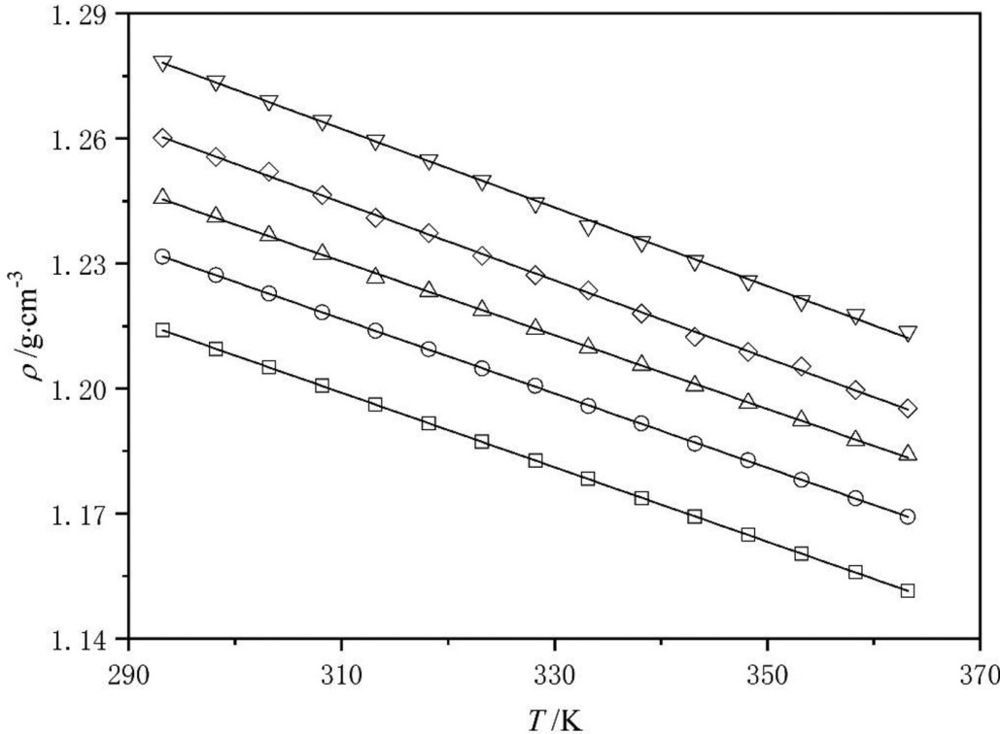
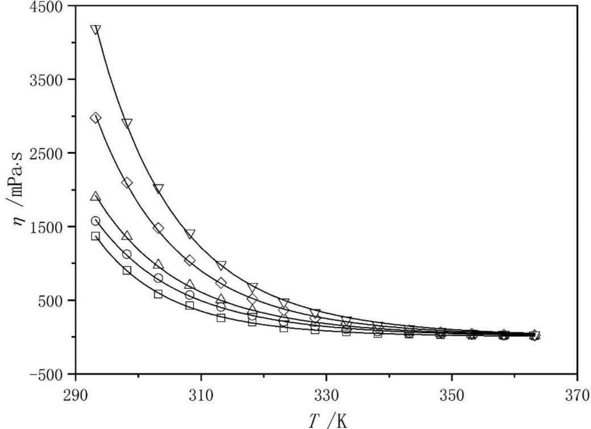
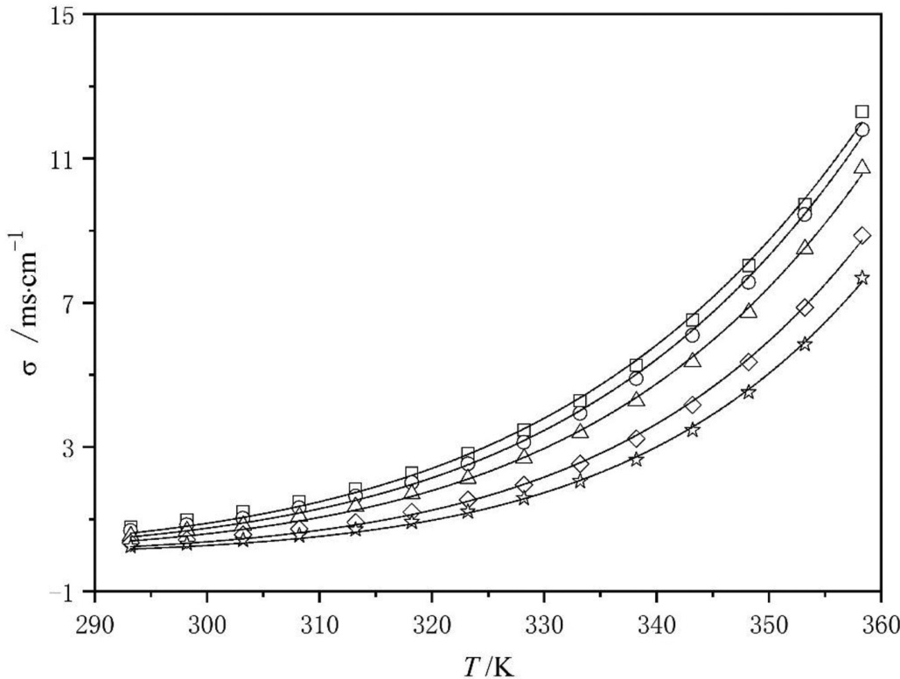
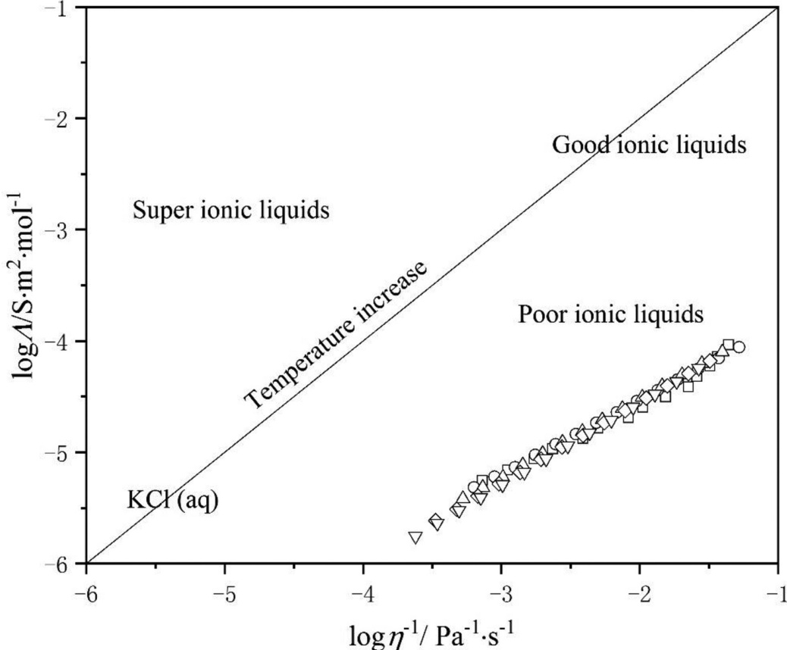
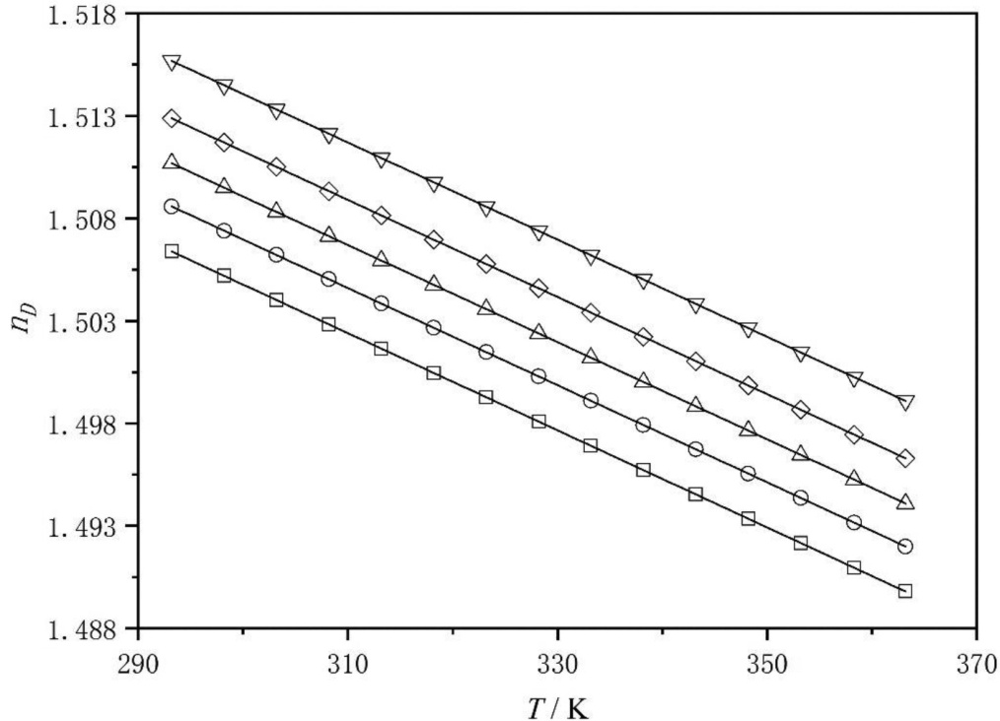
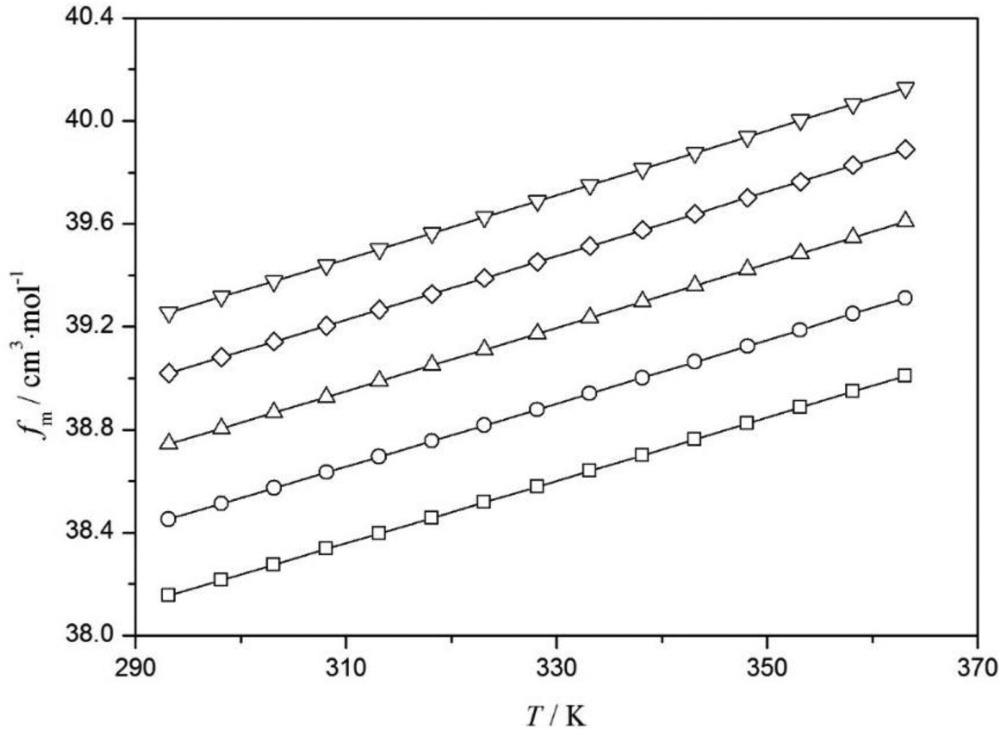
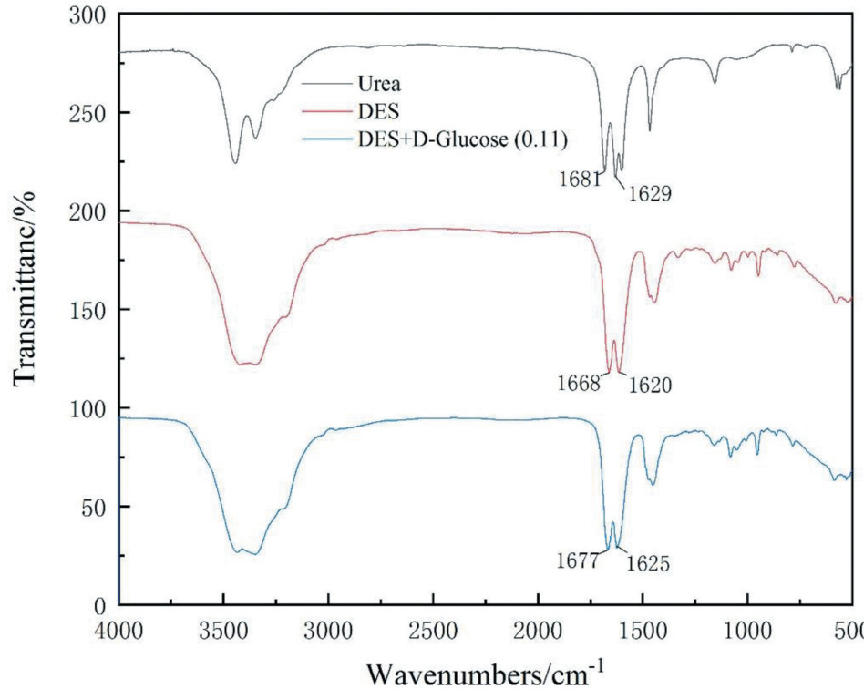

# Density, dynamic viscosity, conductivity and refractive index for mixture D-glucose and deep eutectic solvent (choline chloride $+$ urea) at different temperatures

Chunlu Li, Niannian Wang, Yuanlin Yao, Zhifang Cui, Jun Gao & Dexin Feng

To cite this article: Chunlu Li, Niannian Wang, Yuanlin Yao, Zhifang Cui, Jun Gao & Dexin Feng (2021): Density, dynamic viscosity, conductivity and refractive index for mixture D-glucose and deep eutectic solvent (choline chloride $^ +$ urea) at different temperatures, Physics and Chemistry of Liquids, DOI: 10.1080/00319104.2021.1916930

To link to this article:  https://doi.org/10.1080/00319104.2021.1916930

# ARTICLE

# Density, dynamic viscosity, conductivity and refractive index for mixture D-glucose and deep eutectic solvent (choline chloride $^ +$ urea) at different temperatures

Chunlu Li $\textcircled{1} ^ { \mathsf { a } }$ , Niannian Wanga, Yuanlin Yaoa, Zhifang Cuia, Jun Gao $\oplus ^ { \mathsf { a } }$ and Dexin Fengb

aDepartment of Chemical Engineering, College of Chemical and Biological Engineering, Shandong University of Science and Technology, Qingdao, China; ${ } ^ { \mathsf { b } } { \mathsf { C A S } }$ Key Laboratory of Bio-based Material, Qingdao Institute of Bioenergy and Bioprocess Technology, Chinese Academy of Sciences, Qingdao, China

# ABSTRACT

To convert carbohydrates into platform compounds, the deep eutectic solvent (DES) based on choline chloride and urea (molar ratio 1:2) was adopted as a green solvent. The physical properties of density, dynamic viscosity, conductivity and refractive index were determined for the mix­ ture of D-glucose and DES including neat reline at a temperature from $2 9 3 . 1 5 \mathsf { K }$ to $3 6 3 . 1 5 \mathsf { K }$ at $1 0 1 . 3 \mathsf { k P a }$ . The measured data of density, dynamic viscosity, conductivity and refractive index were correlated, respectively. Meanwhile, the molecular volume, standard molar entropy, lattice energy and free volume were calculated. The spectra of FTIR indicates that the hydrogen bond was changed in the mixture with increasing the content of D-glucose.

ARTICLE HISTORY Received 19 October 2020 Accepted 11 April 2021

# KEYWORDS

Deep eutectic solvent; d-glucose; physical properties; correlation

# 1. Introduction

In converting biomass-derived carbohydrates such as glucose, fructose into platform compounds 5-hydroxymethylfurfural (5-HMF), 5-ethoxymethylfurfural (5-EMF) and laevulinic acid [1], sol­ vent plays a very important role during the successful conversion of these platform compounds [2]. Researchers in this field have been looking for suitable solvents and concerning the physical properties of the solvents [3]. Until now, for conversion of carbohydrates into platform compounds, water, organic compounds and ionic liquids (ILs) have all been selected as the solvents. And the physical properties of these solutions containing the carbohydrates have also been investi­ gated [4,5].

Deep eutectic solvents (DESs), which contained hydrogen bond acceptor (HBA) and hydrogen bond donor (HBD), emerged in 2002 with many advantages, such as low cost, easy synthesis, nontoxicity and biodegradability, which can be used as alternatives to ionic liquids in many applica­ tions, such as separation, biodiesel and green solvents [6–12]. Recently, some literatures reported that the DESs were adopted as the solvents to obtain the platform compounds from carbohydrates [13–19]. Biofuel 5-EMF was produced from glucose in DES by Miao [20] with the yield of $4 6 . 7 \%$ . Han and co-workers [21] synthesised HMF from fructose achieving the selectivity of $8 4 \%$ using choline chloride-based DES.

Sugar, another HBD, was added into the DES to form a ternary system which contains one HBA and two HBDs. The addition of the second HBD influences the original system such as the force of the hydrogen bond, the space among the molecules, etc., and further influences the physical properties of the DES. Physical properties, such as density, dynamic viscosity, conductivity and refractive index (RI), are important for engineering calculations in designing industrial equipment or unit operations.

To evaluate the DESs’ performance in industry applications, it is essential to determine the physical properties of the solutions [22–25, Tay26, 27]. To our knowledge, the physical properties of the mixture formed by D-glucose and DES at different temperatures have not been reported in the literatures.

DES- based on urea and choline chloride was firstly synthesised [7] with low melting point of $1 2 ^ { \circ } \mathrm { C }$ that it is chosen as the solvent in this study. In this work, for converting D-glucose into platform compounds in the solvent of DES (ChCl: urea, molar ratio of 1:2), the properties of density, dynamic viscosity, electrical conductivity and RI of the solutions (including neat reline) with different D-glucose content at different temperatures were investigated, and the measured data was correlated.

# 2. Experimental section

# 2.1 Materials

The CAS registry number, the supplier and the mass fractionof the chemicals in this work are presented in Table 1. All chemicals were dried in vacuum oven (DZF-6020-T, Shanghai Shensheng Co., Ltd) at $3 3 8 . 1 5 \mathrm { K }$ under pressure of $0 . 0 5 \mathrm { k P a }$ for $1 2 \mathrm { ~ h ~ }$ to eliminate moisture before using.

# 2.2 Preparation of mixture of DES and D-glucose

The DES (ChCl and urea, molar ratio 1:2, uncertainty of the molar ratio is 0.004) was synthesised at $3 5 3 . 1 5 \mathrm { ~ K ~ }$ according to the method proposed in literatures [28,29]. The mixture of the DES and D-glucose with different molar fractions (0.02, 0.05, 0.08 and 0.11, uncertainty of molar fraction is 0.004) were stirred at $4 0 0 ~ \mathrm { r p m }$ and $3 5 3 . 1 5 \mathrm { ~ K ~ }$ until a clear and homogenous mixture was obtained. And the molar fraction of D-glucose was defined as the number of moles of D-glucose divided by the total moles number of the mixture. All the preparations were carried out in the glove box (Lab 2000, Etelux, China) filled with argon with the relative humidity less than $0 . 5 \%$ . Then, the water content of the mixture was measured by Karl-Fischer Titrator (MA-2, Kulun, China), and water content in the mixture which showed less than 0.2 wt $\%$ .

# 2.3 Physical property measurements

The density of the prepared mixture was determined using the densimeter (DMA $4 5 0 0 \mathrm { ~ M ~ }$ , Anton Paar, Austria), which was calibrated by measuring the densities of ultrapure water and dried air. The measurement temperature was controlled by an oil bath (DF-101S, Shanghai Lichen Co., Ltd, China) and determined using a mercury thermometer with a standard uncertainty of $^ { \pm 0 . 0 1 }$ K.

The dynamic viscosity was determined by a viscometer (DV3T, Brookfield Instruments, USA), which was calibrated using the zero-calibration method. The temperature was controlled by an external water bath and circulator (HC-10, Protech Technology Enterprise Co., Ltd, China), and the standard uncertainty was $\pm 0 . 0 1$ K.

The electrical conductivity was measured by a conductivity metre (Five Easy Plus FE28-S, METTLER-TOLEDO Co., Ltd, Switzerland). The electrical conductivity of 0.01 M KCl aqueous solution was analysed before each measurement for calibration. The oil bath was used to control the temperature with a standard uncertainty of $\pm 0 . 1 \mathrm { ~ K ~ }$ .

Table 1. CAS registry number and mass fraction purity of the chemicals.   

<html><body><table><tr><td>Component</td><td>CAS reg. no.</td><td>Suppliers</td><td>Mass fraction</td></tr><tr><td>2-Hydroxy-N,N,N-trimethylethanaminium chloride</td><td>67-48-1</td><td>Shanghai Macklin Co., Ltd</td><td>0.990</td></tr><tr><td>D-glucose</td><td>50-99-7</td><td>Tianjin Fuyu Chemical Co., Ltd</td><td>0.995</td></tr><tr><td>Urea</td><td>57-13-6</td><td>Tianjin Kemiou Chemical Co., Ltd</td><td>0.995</td></tr></table></body></html>

The RI was measured using an Abbe refractometer (WAY-2S, Shantou Keyi Co., Ltd, China), which was calibrated with monobromonapthalene before measurement. The light source was a sodium arc lamp with the wavelength of $5 8 9 . 3 ~ \mathrm { n m }$ . The sample temperature was maintained by a constant-temperature water circulator (501A, Shanghai Experimental Equipment Co., Ltd, China).

All the measurements were performed at $1 0 1 . 3 \mathrm { ~ k P a }$ . Each property value for the mixture was measured three times and the averaged value was adopted.

To explore the interactions of the components in the mixture, the mixture was characterised by Fourier transform infrared spectroscopy (VERTEX70, Germany Brooke Co., Ltd, German) at $4 0 0 { \mathrm { - } } 4 0 0 0 ~ { \mathrm { c m } } ^ { - 1 }$ .

# 3. Results and discussion

# 3.1 Density

The density data for the mixture of $\mathrm { D E S } + \mathrm { D }$ -glucose are listed in Table S1 and presented in Figure 1. Some literature density values of neat DES are also listed in Table S1 for comparison. Figure 1 shows the influence of temperature and D-glucose on the density of the mixture. The density of D-glucose $( 1 . 5 4 ~ \mathrm { g } \cdot \mathrm { c m } ^ { - 3 } )$ , is higher than neat DES. The density decreased with the increase of temperature for every $\operatorname { C h C l + }$ urea) $+ \mathrm { ~ D ~ }$ -glucose mixture. It could be seen that with the addition of D-glucose the density of the mixture increased.

The measured density data were fitted by the following equation [30]:

$$
\rho = \rho _ { 0 } + A T
$$

  
Figure 1. Density of ${ \mathsf { D E S } } + { \mathsf { D } } $ -glucose: molar fraction of D-glucose (□, 0.00; ○, 0.02; $\triangle ,$ 0.05; $\diamondsuit$ , 0.08; $\bigtriangledown$ , 0.11). – represent fit to Eq. 1.

Table 2. Correlated value of the parameters for Eq 1 and ${ \sf R } ^ { 2 }$   

<html><body><table><tr><td rowspan="2">Molar fraction of D-glucose</td><td colspan="4">Fittingparameters</td><td rowspan="2">R²</td></tr><tr><td>Po (g·cm-3)</td><td>Standard error</td><td>A/x10-4 (g·cm-³.K-1)</td><td>Standard error</td></tr><tr><td>0.00</td><td>1.4759</td><td>0.0002</td><td>-8.9344</td><td>6.22 ×10-7</td><td>0.9999</td></tr><tr><td>0.02</td><td>1.4932</td><td>0.0005</td><td>-8.9209</td><td>1.64 × 10-6</td><td>0.9999</td></tr><tr><td>0.05</td><td>1.5048</td><td>0.0016</td><td>-8.8505</td><td>4.89 × 10-6</td><td>0.9995</td></tr><tr><td>0.08</td><td>1.5339</td><td>0.0025</td><td>-9.3341</td><td>7.44 × 10-6</td><td>0.9991</td></tr><tr><td>0.11</td><td>1.5545</td><td>0.0029</td><td>-9.4282</td><td>8.82 × 10-6</td><td>0.9988</td></tr></table></body></html>

where $\rho$ is the density of the mixture. The values of $\dot { \rho } _ { 0 } , A$ and $R ^ { 2 }$ of the correlation are listed in Table 2. For each mixture, temperature showed a simple linear relationship with density at the investi­ gated temperature range (293.15–363.15 K). Meanwhile, at the same temperature, the values of density were also linearly dependent on the molar fraction of D-glucose.

The derived properties, molecular volume $( V _ { \mathrm { m } } )$ , standard molar entropy $( \boldsymbol { S } ^ { \boldsymbol { o } } )$ and lattice energy $( U _ { \mathrm { P O T } } )$ were calculated based on the experimental data by the following equations [31,32]:

$$
V _ { m } = M _ { \mathrm { M i x t u r e } } / ( N _ { \mathrm { A } } \rho )
$$

$$
S ^ { 0 } = 1 2 4 6 . 5 V _ { m } + 2 9 . 5
$$

$$
U _ { \mathrm { P O T } } = 1 9 8 1 . 2 \big ( \rho / M _ { \mathrm { M i x t u r e } } \big ) ^ { 1 / 3 } + 1 0 3 . 8
$$

where $\rho$ is the density of the mixture; $M _ { \mathrm { M i x t u r e } }$ is the molecular mass of $( \mathrm { D E S + D }$ -glucose) and $N _ { \mathrm { A } }$ is the Avogadro’s number. Table 3 lists the calculated property values for the mixtures of DES with different content of D-glucose at $2 9 8 . 1 5 \mathrm { ~ K ~ }$ . Molecular volume, standard molar entropy and lattice energy increase with the addition of D-glucose.

# 3.2 Dynamic viscosity

The measured and literature dynamic viscosity data for the $\mathrm { D E S } + \mathrm { D }$ -glucose mixture at different temperatures are listed in Table S2 and plotted in Figure 2. For comparison, the dynamic viscosity data for the pure DES reported in literature are presented in Table S3, and the measured dynamic viscosity data for the pure DES in this study did not agree well with all the reported in the literature. The data of neat DES based on choline chloride and urea is inconsistent, especially when the temperature is lower than $3 2 8 . 1 5 ~ \mathrm { K } .$ which may be due to the water content, purity of the reagent and instrument. In Figure 2, moreover, with adding the content of D-glucose, the viscosity values of the mixture increase, and decrease with increasing the temperature. The higher the molar fraction of D-glucose in the mixture, the higher the viscosity of the mixture. When the temperature is less than $3 2 8 . 1 5 \mathrm { K } ,$ , the viscosity of the mixture varies significantly with the addition of glucose.

The measured dynamic viscosity data were fitted by the Arrhenius equation and Vogel−Fulcher −Tamman (VFT) equation [4,22,33,34]:

$$
\eta = B _ { 0 } \exp ( - B / T )
$$

Table 3. Calculated property values for ${ \mathsf { D E S } } + { \mathsf { D } }$ -glucose at $2 9 8 . 1 5 1 6 .$   

<html><body><table><tr><td rowspan="2">Property</td><td colspan="5">Molar fraction of D-glucose</td></tr><tr><td>0.00</td><td>0.02</td><td>0.05</td><td>0.08</td><td>0.11</td></tr><tr><td>Vm (nm3)</td><td>0.3566</td><td>0.3563</td><td>0.3595</td><td>0.3625</td><td>0.3644</td></tr><tr><td>5°(J·K-1.mol−1)</td><td>474</td><td>473</td><td>477</td><td>481</td><td>483</td></tr><tr><td>UPOT (kJ·mol-1)</td><td>331.25</td><td>331.32</td><td>330.33</td><td>329.41</td><td>328.84</td></tr></table></body></html>

Table 4. Correlated values of the parameters for Eq. 5 and $R ^ { 2 . }$   

<html><body><table><tr><td rowspan="2">Molar fractionof D-glucose</td><td colspan="4">Fitting parameters for Eq.5</td><td rowspan="2">R²</td></tr><tr><td>B/10-8(mPa·s)</td><td>Standard error</td><td>B (K)</td><td>Standard error</td></tr><tr><td>0.00</td><td>1.69</td><td>9.08 × 10-13</td><td>7364</td><td>3.28</td><td>0.9992</td></tr><tr><td>0.02</td><td>64.43</td><td>8.40 × 10-13</td><td>6342</td><td>1.14</td><td>0.9991</td></tr><tr><td>0.05</td><td>120.30</td><td>17.2 × 10-13</td><td>6213</td><td>1.61</td><td>0.9990</td></tr><tr><td>0.08</td><td>62.50</td><td>7.15 × 10-13</td><td>6537</td><td>4.23</td><td>0.9991</td></tr><tr><td>0.11</td><td>43.78</td><td>4.43 ×10-13</td><td>6741</td><td>2.63</td><td>0.9992</td></tr></table></body></html>

Table 5. Correlated values of the parameters for Eq. 6 and $R ^ { 2 . }$ .   

<html><body><table><tr><td></td><td colspan="6">Fitting parameters for Eq.6</td><td></td></tr><tr><td>Molar fraction of D-glucose</td><td>B1/10-4(mPa·s)</td><td>Standard error</td><td>B2(K)</td><td>Standard error</td><td>To(K)</td><td>Stand error</td><td>R²</td></tr><tr><td>0.00</td><td>0.782</td><td>3.54×10-8</td><td>3303</td><td>1.12</td><td>94.84</td><td>0.146</td><td>0.9983</td></tr><tr><td>0.02</td><td>1.213</td><td>2.48×10-8</td><td>3543</td><td>1.75</td><td>77.05</td><td>0.172</td><td>0.9982</td></tr><tr><td>0.05</td><td>2.627</td><td>4.18 × 10-8</td><td>3355</td><td>1.78</td><td>80.98</td><td>0.173</td><td>0.9981</td></tr><tr><td>0.08</td><td>2.093</td><td>7.98 ×10-8</td><td>3469</td><td>1.50</td><td>82.76</td><td>0.139</td><td>0.9982</td></tr><tr><td>0.11</td><td>2.704</td><td>7.31×10-8</td><td>3391</td><td>1.67</td><td>88.51</td><td>0.184</td><td>0.9983</td></tr></table></body></html>

Table 6. Correlated values of the parameters for Eq. 7, standard error and $R ^ { 2 }$ .   

<html><body><table><tr><td></td><td colspan="5">Fitting parameters for Eq.7</td></tr><tr><td>Molar fraction of D-glucose</td><td>Co/106(S·m-1)</td><td>Standard error</td><td>C (K)</td><td>Standard error</td><td>R²</td></tr><tr><td>0.00</td><td>8.91×10</td><td>2.28 × 106</td><td>4842</td><td>92</td><td>0.998</td></tr><tr><td>0.02</td><td>1.69 × 10</td><td>4.13 × 10</td><td>5082</td><td>88</td><td>0.998</td></tr><tr><td>0.05</td><td>3.22 ×107</td><td>8.88 ×106</td><td>5350</td><td>99</td><td>0.998</td></tr><tr><td>0.08</td><td>1.09 ×10</td><td>3.01×107</td><td>5854</td><td>101</td><td>0.998</td></tr><tr><td>0.11</td><td>2.18×108</td><td>5.42×10</td><td>6154</td><td>90</td><td>0.999</td></tr></table></body></html>

Table 7. Correlated values of the parameters for Eq. 8, standard error and $R ^ { 2 }$ .   

<html><body><table><tr><td rowspan="2">Molar fraction of D-glucose</td><td colspan="7">Fitting parameters for Eq.8</td></tr><tr><td>C (S.cm-1)</td><td>Stand error</td><td>C2(K)</td><td>Standard error</td><td>To(K)</td><td>Standard error</td><td>R²</td></tr><tr><td>0.00</td><td>0.349</td><td>1.65×10-8</td><td>382</td><td>1.18</td><td>245</td><td>0.149</td><td>0.978</td></tr><tr><td>0.02</td><td>0.397</td><td>3.14 ×10-8</td><td>483</td><td>1.75</td><td>225</td><td>0.165</td><td>0.977</td></tr><tr><td>0.05</td><td>0.345</td><td>7.46 × 10-8</td><td>402</td><td>1.77</td><td>245</td><td>0.148</td><td>0.983</td></tr><tr><td>0.08</td><td>1.044</td><td>7.89 × 10-8</td><td>620</td><td>1.72</td><td>229</td><td>0.169</td><td>0.988</td></tr><tr><td>0.11</td><td>1.125</td><td>4.83×10-8</td><td>662</td><td>1.67</td><td>226</td><td>0.187</td><td>0.990</td></tr></table></body></html>

$$
\eta = B _ { 1 } \exp ( B _ { 2 } / ( T - T _ { 0 } ) )
$$

where $\eta$ is the dynamic viscosity; $B _ { 0 } , B , B _ { 1 } , B _ { 2 } , T _ { 0 } ,$ are the parameters; and $T$ is the temperature. The correlated values of the parameters and $R ^ { 2 }$ are listed in Tables 4 and 5.

# 3.3 Conductivity

The conductivity for the mixture was measured and is presented in Table S3 and plotted in Figure 3. The estimated conductivity value of the figure from the literature is also listed in Table S3 for comparison. As shown in Figure 3, with increasing the content of D-glucose, the conductivity decreases, while the conductivity increases with increasing the temperature. Conductivity is strongly correlated with viscosity: the higher the viscosity, the lower the conductivity [35]. This trend was not changed with the addition of D-glucose. Compared to the effect of temperature on dynamic viscosity, conductivity is influenced by temperature, especially when the temperature is higher than 328.15 K.

  
Figure 2. Dynamic viscosity of ${ \mathsf { D E S } } + { \mathsf { D } } .$ -glucose: molar fraction of D-glucose (□, 0.00; ○, 0.02; △, 0.05; $\diamondsuit$ , 0.08; $\bigtriangledown$ , 0.11). – fitted by Eq. 6.

  
Figure 3. Conductivity of DES $^ +$ D-glucose: molar fraction of D-glucose $\{ \ldots , 0 . 0 0 ; \circ , 0 . 0 2$ ; , $0 . 0 5 ;$ , 0.08; , 0.11). – fitted by Eq. 7.

Usually, the measured conductivity data were fitted by the Arrhenius equation and VFT equation [33]:

$$
\sigma C _ { 0 } \mathrm { e x p } { ( - C / T ) }
$$

$$
\sigma = { C _ { 1 } } \exp ( { C _ { 2 } } / { ( T - T _ { 0 } ) } )
$$

where $\sigma$ is conductivity; $C _ { 0 } , C , C _ { 1 } , C _ { 2 } , T _ { 0 }$ are the parameters; $T$ is temperature. The fitted values of the parameters are listed in Tables 6 and 7.

The relationship between dynamic viscosity and electrical conductivity can be discussed by the Walden rule [33]. Molar conductivity can be calculated by the following equations [36]:

$$
\Lambda \sigma M / \rho
$$

$$
\varLambda \eta ^ { \alpha } k
$$

$$
\log \Lambda = \log k + \alpha \mathrm { l o g } \eta ^ { - 1 }
$$

where $\varLambda$ is the molar conductivity, $\eta$ is the dynamic viscosity and $k$ is the temperature-dependent constant. The molar conductivity of mixture is shown in Table S4 and the $\log \bar { \Lambda } - \log \eta ^ { - 1 }$ plot is shown in Figure 4 with ideal line of aqueous solution. It can be seen from Figure 4 that all the Walden plots of mixtures are under the ideal line which mean that all the $( \mathrm { D E S } + \mathrm { D }$ -glucose) mixtures are ‘subionic’, which is plotted by using aqueous KCl solution at high dilution. The slopes and intercepts of all the Walden plat are shown in Table 8. All the values of the slopes are smaller than 1, predicting a progressive increase of the value of conductivity as increasing in quantity of less conductive ion pairs when being heated according to the Walden rule.

  
Figure 4. Plot of logΛ versus log $\mathfrak { n } ^ { - 1 }$ for DESs 293.15–363.15 K. the solid straight line is the ideal line for aqueous KCl solutions (□, 0.00; ○, 0.02; $\triangle ,$ 0.05; $\diamondsuit$ , 0.08; $\bigtriangledown$ , 0.11).

Table 8. Correlated values of fitting parameters for Eq. 11 and $R ^ { 2 }$ .   

<html><body><table><tr><td rowspan="2">Molar fraction of D-glucose</td><td colspan="2">Fitting parameters</td><td rowspan="2">R²</td></tr><tr><td>a</td><td>log k</td></tr><tr><td>0.00</td><td>0.6497</td><td>-3.2696</td><td>0.9791</td></tr><tr><td>0.02</td><td>0.6593</td><td>-3.2108</td><td>0.9999</td></tr><tr><td>0.05</td><td>0.7055</td><td>-3.1063</td><td>0.9999</td></tr><tr><td>0.08</td><td>0.7255</td><td>-3.0971</td><td>0.9999</td></tr><tr><td>0.11</td><td>0.7371</td><td>-3.0850</td><td>0.9999</td></tr></table></body></html>

# 3.4 Refractive index

The measured RI and literature data for the mixture are presented in Table S5 and Figure 5. For comparison, the RI data for the pure DES reported in literature were presented in Table S6, which is consistent with that measured in this work [33]. As seen from Figure 5, the RI decreases with increasing the temperature, while at the same temperature, the RI increases with the increase of D-glucose concentration.

The measured RI data can be correlated by Eq. 12 [37]:

$$
n _ { \mathrm { D } } = D _ { 0 } + D T
$$

where $n _ { \mathrm { D } }$ is the refractive index; $D _ { 0 } , D$ are the parameters; and $T$ is the experimental temperature.   
The fitted values of $D _ { 0 }$ and $D$ are listed in Table 9.

The free volume $( f _ { m } )$ can be considered as the interstice or available free space in the media. With increase of freevolume, light can travel at a higher velocity [34]. To explore the effect of the

  
Figure 5. Refractive index of ${ \mathsf { D E S } } + { \mathsf { D } } $ -glucose: molar fraction of D-glucose (□, 0.00; ○, 0.02; $\bigtriangleup$ , 0.05; $\diamondsuit$ , 0.08; $\bigtriangledown$ , 0.11). – fit to Eq. 12.

Table 9. Correlated values of fitting parameters for Eq. 12 and $R ^ { 2 }$   

<html><body><table><tr><td rowspan="2">Molar fraction of D-glucose</td><td colspan="2">Fitting parameters</td><td rowspan="2">R²</td></tr><tr><td>D</td><td>D×10-4</td></tr><tr><td>0.00</td><td>1.57642</td><td>-2.38803</td><td>0.9996</td></tr><tr><td>0.02</td><td>1.57878</td><td>-2.39015</td><td>0.9998</td></tr><tr><td>0.05</td><td>1.57997</td><td>2.36352</td><td>0.9999</td></tr><tr><td>0.08</td><td>1.58262</td><td>2.37753</td><td>0.9999</td></tr><tr><td>0.11</td><td>1.58567</td><td>2.38510</td><td>0.9999</td></tr></table></body></html>

  
Figure 6. Free volume $( f _ { m } )$ of ${ \mathsf { D E S } } + { \mathsf { D } } { \mathsf { \cdot } }$ -glucose: molar fraction of D-glucose (□, 0.00; ○, 0.02; , 0.05; , 0.08; , 0.11).

addition on D-glucose on free volume, the free volume $f _ { \mathrm { m } }$ was calculated by the following Eqs. 13 and 4 [38]:

$$
f _ { m } = V - R _ { m }
$$

$$
R _ { m } = \frac { n _ { D } ^ { 2 } - 1 } { n _ { D } ^ { 2 } + 2 } \times V
$$

where $f _ { \mathrm { m } } ( \mathrm { c m } ^ { 3 } { \cdot } \mathrm { m o l } ^ { - 1 } )$ is free volume, $V ( \mathrm { c m } ^ { 3 } { \cdot } \mathrm { m o l } ^ { - 1 } )$ is molar volume and $R _ { \mathrm { m } } ( \mathrm { c m } ^ { 3 } { \cdot } \mathrm { m o l } ^ { - 1 } )$ is molar refraction.

The calculated results of $f _ { \mathrm { m } }$ are presented in Table S6 and plotted in Figure 6. As shown in Figure 6, the values of $f _ { \mathrm { m } }$ increase with increasing of the content of D-glucose. Meanwhile, increasing temperature can lead to thermal expansion of the mixtures, which can provide more space to let light pass through the medium. Therefore, decreasing of the RI due to the increasing of $f _ { \mathrm { m } }$ [39].

  
Figure 7. FTIR spectra of urea, DES and mixture (molar fraction of D-glucose is 0.11).

# 4. Fourier transform infrared spectroscopy (FTIR)

The FTIR is essential to study changes of the functional groups in the mixtures after the addition of D-glucose to analyse the interaction between the molecular, especially between the HBD and HBA. The FTIR spectra of the pure DES and $\mathrm { D E S } + \mathrm { D }$ -glucose (molar fraction is 0.11) mixture are shown in Figure 7. For the spectrum of pure DES, $_ \mathrm { N - H }$ peak appeared at 1668  and $1 6 2 0 ~ \mathrm { { c m } ^ { - 1 } }$ , which agreed with those reported in the literature [33,40]. Yue reported that the peaks of $_ \mathrm { N - H }$ shifted to lower wavenumbers due to the formation of strong hydrogen bonds. As seen from Figure 7, the peak of $_ \mathrm { N - H }$ shifts to lower wavenumber (from $1 6 8 1 ~ \mathrm { { c m } ^ { - 1 } }$ to $1 6 6 8 ~ \mathrm { { c m } ^ { - 1 } }$ and from $1 6 2 9 ~ \mathrm { { c m } ^ { - 1 } }$ to $\bar { 1 } 6 2 0 { \mathrm { c m } } ^ { - 1 } ,$ ) due to the formation of strong hydrogen bonds between urea and choline chloride. But with adding the content of D-glucose, two peaks shift back to higher wavenumber (from $1 6 6 8 ~ \mathrm { { c m } ^ { - 1 } }$ to $1 6 7 7 \mathrm { c m } ^ { - 1 }$ and from $1 6 2 0 \mathrm { c m } ^ { - 1 }$ to $1 6 2 5 \mathrm { c m } ^ { - 1 }$ ), implying that $_ \mathrm { N - H }$ was stronger than in pure DES which could be due to urea in the hydrogen bond system is partially instead of D-glucose. D-glucose and choline chloride-based DES have much higher viscosity than the DES based on urea and choline chloride [41]. The hydrogen bond formed by $_ \mathrm { O - H }$ is much stronger than by $_ \mathrm { N - H }$ , and this can also be realised by comparing the viscosity of pure DES and the mixture of $\mathrm { D E S + D }$ -glucose.

# 5. Conclusions

For conversion of D-glucose to platform compounds with the solvent of DES, the properties density, dynamic viscosity, conductivity and RI for the mixture $\mathrm { \Delta [ D E S + D }$ -glucose) were measured at temperature from 293.15 to 363.15 K. With the measured density data for the mixture, the values of molecular volume, standard molar entropy and lattice energy were calculated. Also, the free volume values for the mixture were also calculated based on the measured RI data. Both the temperature and D-glucose content had obvious effects on these physical properties for the mixture. Meanwhile, all the measured data for the mixture were correlated. Finally, FTIR spectra revealed that the hydrogen bond formed in the mixture was also influenced by the addition of D-glucose.

# Notes

The authors declare no competing financial interest.

# Disclosure statement

No potential conflict of interest was reported by the author(s).

# Funding

Financial support from Key Laboratory of Bio-based Material, Qingdao Institute of Bioenergy and Bioprocess Technology, Chinese Academy of Sciences (No. KLBM2016003) is greatly acknowledged;Open Fund from Qingdao Institute of Bioenergy and Bioprocess Technology, Chinese Academy of Sciences [No. KLBM2016003];

# ORCID

Chunlu Li $\textcircled{1}$ http://orcid.org/0000-0003-2511-7478   
Jun Gao $\textcircled{1}$ http://orcid.org/0000-0003-1145-9565

# References

[1] Srirangan K, Akawi L, Moo-Young M, et al. Towards sustainable production of clean energy carriers from biomass resources. Appl Energy. 2012;100:172–186.   
[2] Clark JH, Fabien E, Farmer TJ. The integration of green chemistry into future biorefineries. Biofuels Bioprod Biorefin. 2009;3(1):72–90. .   
[3] Hassan El SR, Mutelet F, Pontvianne S, et al. Studies on the dissolution of glucose in ionic liquids and extraction using the antisolvent method. Environ Sci Technol. 2013;47(6):2809–2816.   
[4] Liu C, Chen W, Wu Z, et al. Density, viscosity and electrical conductivity of AlCl 3 -amide ionic liquid analogues. J Mol Liq. 2017;247:57–63.   
[5] Tariq M, Forte PAS, Gomes MFC, et al. Densities and refractive indices of imidazolium- and phosphonium-based ionic liquids: effect of temperature, alkyl chain length, and anion. J Chem Thermodyn. 2009;41(6):790–798.   
[6] Abbott AP. Novel solvent properties of choline chloride/urea mixtures. Chem Commun. 2002;3: 70–71. Cambridge, U K.   
[7] Abbott AP, Capper G, Davies DL, et al. Novel solvent properties of choline chloride/urea mixtures. Chem Commun. 2003;9(1):70–71. Cambridge, U K. .   
[8] Jiang H, Xu D, Zhang L, et al. Vapor–liquid phase equilibrium for separation of isopropanol from its aqueous solution by Choline Chloride-based deep eutectic solvent selected by COSMO-SAC. Model J Chem Eng Data. 2019;64(4):1338–1348. .   
[9] Liu X, Xu D, Diao B. Choline chloride based deep eutectic solvents selection and liquid-liquid equilibrium for separation of dimethyl carbonate and ethanol. J Mol Liq. 2019;275:347–353.   
[10] Liu X, Xu D, Diao B, et al. Separation of dimethyl carbonate and methanol by deep eutectic solvents: liquid– liquid equilibrium measurements and thermodynamic modeling. J Chem Eng Data. 2018;63(5):1234–1239.   
[11] Troter DZ, Todorović ZB, Đokić-Stojanović DR, et al. Choline chloride-based deep eutectic solvents in CaO-catalyzed ethanolysis of expired sunflower oil. J Mol Liq. 2018;266:557-567.   
[12] Wang S, Peng X, Zhong L, et al. Choline chloride/urea as an effective plasticizer for production of cellulose films. Carbohydr Polym. 2015;117:133–139.   
[13] Jerome F, Vigier K. Catalytic conversion of carbohydrates to furanic derivatives in the presence of Choline Chloride. Catalysts. 2017;7:1–11.   
[14] Carrion Prieto P, Martin Ramos P, Hernandez Navarro S, et al. Furfural, 5-HMF, acid-soluble lignin and sugar contents in C. ladanifer and E. arborea lignocellulosic biomass hydrolysates obtained from microwave-assisted treatments in different solvents. Biomass Bioenergy. 2018;119:135–143.   
[15] Qin Y, Li Y, Zong M, et al. Enzyme-catalyzed selective oxidation of 5-hydroxymethylfurfural (HMF) and separation of HMF and 2,5-diformylfuran using deep eutectic solvents. Green Chem. 2015;17(7):3718–3722.   
[16] Sun Z, Wang S, Wang X, et al. Lysine functional heteropolyacid nanospheres as bifunctional acid–base catalysts for cascade conversion of glucose to levulinic acid. Fuel. 2016;164:262–266.   
[17] Xiong C, Sun Y, Du J, et al. Efficient conversion of fructose to 5-[(formyloxy)methyl]furfural by reactive extraction and in-situ esterification Korean. J Chem Eng. 2018;35:1312–1318.   
[18] Zhang J, Xiao dehydration into 5-Hydroxymethylfurfural in the deep eutectic solvent of [Emim]Cl/Alcohol. ACS Sustainable Chem Eng. 2016;4(7):3995–4002.   
[19] Zuo M, Li Z, Jiang Y, et al. Green catalytic conversion of bio-based sugars to 5-chloromethyl furfural in deep eutectic solvent, catalyzed by metal chlorides. RSC Adv. 2016;6(32):27004–27007.   
[20] Zuo M, Le K, Feng Y, et al. An effective pathway for converting carbohydrates to biofuel 5-ethoxymethylfurfural via 5-hydroxymethylfurfural with deep eutectic solvents (DESs). Ind Crops Prod. 2018;112:18–23.   
[21] Hu S, Zhang Z, Zhou Y, et al. Conversion of fructose to 5-hydroxymethylfurfural using ionic liquids prepared from renewable materials. Green Chem. 2008;10(12):1280–1283. .   
[22] Anita Y, Pandey S. Densities and viscosities of (choline chloride $^ +$ urea) deep eutectic solvent and its aqueous mixtures in the temperature range $2 9 3 . 1 5 \mathrm { K }$ to $3 6 3 . 1 5 \mathrm { K } .$ J Chem Eng Data. 2014;59(7):2221–2229.   
[23] Harifi-Mood AR, Buchner R. Density, viscosity, and conductivity of choline chloride $^ +$ ethylene glycol as a deep eutectic solvent and its binary mixtures with dimethyl sulfoxide. J Mol Liq. 2017;225:689–695.   
[24] Scopus Díaz-Ruiz R, Bergua F, Muñoz Embid J, et al. The hydration behavior of D-glucose in the choline chloride: urea: watermixtures. J Mol Liq. 2020;314. DOI:10.1016/j.molliq.2020.113649   
[25] Shahbaz K, Baroutian S, Mjalli FS, et al. Densities of ammonium and phosphonium based deep eutectic solvents: prediction using artificial intelligence and group contribution techniques. Thermochim Acta. 2012;527:59–66.   
[26] Taysun MB, Sert E, Atalay FS. Physical properties of benzyl tri-methyl ammonium chloride based deep eutectic solvents and employment as catalyst. J Mol Liq. 2016;223:845–852.   
[27] Yadav A, Kar JR, Verma M, et al. Densities of aqueous mixtures of (choline chloride $^ +$ ethylene glycol) and (choline chloride $^ +$ malonic acid) deep eutectic solvents in temperature range 283.15–363.15K. Thermochim Acta. 2015;600:95–101.   
[28] Shekaari H, Zafarani-Moattar MT, Mohammadi B. Thermophysical characterization of aqueous deep eutectic solvent (choline chloride/urea) solutions in full ranges of concentration at $\mathrm { T } = ( 2 9 3 . 1 5 - 3 2 3 . 1 5 ) \mathrm { K . ~ J \ M o l \ L i }$ q. 2017;243:451–461.   
[29] Fareeda C, Anjum H, Shariff AM. Thermal and physical properties of (Choline chloride+urea+l-arginine) deep eutectic solvents. J Mol Liq. 2016;218:301–308.   
[30] Khan A, Man Z, Arvina A, et al. Dicationic imidazolium based ionic liquids: synthesis and properties. J Mol Liq. 2017;227:98–105.   
[31] Glasser L. Lattice and phase transition thermodynamics of ionic liquids. Thermochim Acta. 2004;421 (1–2):87–93.   
[32] Jenkins HDB, Glasser L. Standard absolute entropy, ${ { S _ { 2 9 8 } } ^ { 0 } }$ , Values from Volume or Density. 1. Inorganic Materials. Inorg Chem. 2003;42(26):8702–8708.   
[33] Troter D, Todorovic Z, Dokic-Stojanovic D, et al. The physicochemical and thermodynamic properties of the choline chloride-based deep eutectic solvents. J Serb Chem Soc. 2017;82(9):1039–1052.   
[34] Zhu J, Yu K, Zhu Y, et al. Physicochemical properties of deep eutectic solvents formed by choline chloride and phenolic compounds at $\mathrm { T } = ( 2 9 3 . 1 5 \$ to 333.15) K: the influence of electronic effect of substitution group. J Mol Liq. 2017;232:182–187.   
[35] García G, Aparicio S, Ullah $\begin{array} { r } { \mathbb { R } , } \end{array}$ et al. Deep eutectic solvents: physicochemical properties and gas separation applications. Energy Fuels. 2015;29:2616–2644.   
[36] Su H, Yin J, Liu Q, et al. Properties of four deep eutectic solvents: density, electrical conductivity, dynamic viscosity and refractive index. Acta Phys Chim Sin. 2015;31(8):1468. .   
[37] Hayyan A, Mjalli FS, AlNashef IM, et al. Fruit sugar-based deep eutectic solvents and their physical properties. Thermochim Acta. 2012;541:70–75.   
[38] Florindo C, Oliveira FS, Rebelo LPN, et al. Insights into the synthesis and properties of deep eutectic solvents based on Cholinium Chloride and carboxylic acids ACS sustainable. Chem Eng. 2014;2:2416–2425.   
[39] Chemat F, You HJ, Muthukumar K, et al. Effect of l-arginine on the physical properties of choline chloride and glycerol based deep eutectic solvents. J Mol Liq. 2015;212:605–611.   
[40] Yue D, Jia Y, Yao Y, et al. Structure and electrochemical behavior of ionic liquid analogue based on choline chloride and urea. Electrochim Acta. 2012;65:30–36.   
[41] Hayyan A, Mjalli FS, AlNashef IM, et al. Glucose-based deep eutectic solvents: physical properties. J Mol Liq. 2013;178:137–141.