# Accepted Manuscript

Overview of Acidic Deep Eutectic Solvents on Synthesis, Properties and Applications Hao Qin, Xutao Hu, Jingwen Wang, Hongye Cheng, Lifang Chen, Zhiwen Qi

PII: S2468-0257(18)30143-2   
DOI: https://doi.org/10.1016/j.gee.2019.03.002   
Reference: GEE 162

To appear in: Green Energy and Environment

Received Date: 12 December 2018

Revised Date: 31 January 2019

Accepted Date: 11 March 2019

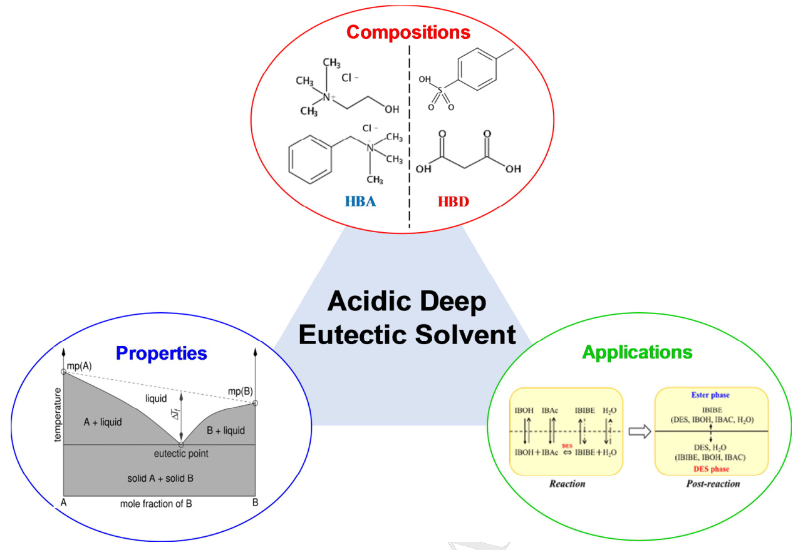

1. The components and synthesis methods are described and discussed; 2. The important physicochemical properties are summarized and presented; 3. The applications of ADES in various fields are introduced, and the future outlooks are also proposed.

# Overview of Acidic Deep Eutectic Solvents on Synthesis, Properties and Applications

Hao Qin, Xutao Hu, Jingwen Wang, Hongye Cheng, Lifang Chen, Zhiwen Qi\*

Max Planck Partner Group at the State Key Laboratory of Chemical Engineering, School of Chemical Engineering, East China University of Science and Technology, 130 Meilong Road, Shanghai 200237, China

\*Corresponding author: zwqi $@$ ecust.edu.cn (Z. Qi)

# Abstract

This review divides the acidic deep eutectic solvents (ADES) into Brønsted and Lewis DES according to their diversity of acidic character. The hydrogen bond donors and halide salts for formulating an ADES are classified, the synthesis methods are described, and the physicochemical properties including freezing point, acidity, density, viscosity and conductivity are presented. Furthermore, the applications of Brønsted acidic deep eutectic solvents (BADES) and Lewis acidic deep eutectic solvents (LADES) are overviewed, respectively, covering the fields in dissolution, extraction, organic reaction and metal electrodeposition. It is expected that the ADES has great potential to replace the pollutional mineral acid, expensive and unstable solid acid, and costly ionic liquid in many acid-employed chemical processes, thus meeting the demands of green chemistry.

Keywords: acidic deep eutectic solvent; Brønsted acidity; Lewis acidity; green chemistry.

# 1. Introduction

The concept of green chemistry has been deeply ingrained since it was first proposed in the early 1990’s. Consequently, the prior target in chemical production of minimizing the environmental impact of solvents is challenged to find greener solvents [1,2]. In this connection, impressive progress has been made thanks to the emergency of ionic liquids (ILs), which are defined as a group of organic salts with low melting points below $1 0 0 ^ { \circ } \mathrm { C }$ [3-5]. ILs have demonstrated many advantages and harvested continuing success due to their distinct physicochemical properties, including wide liquid range, negligible vapor pressure, low flammability, and designability [6,69,70]. Despite the above merits, the green affiliation of ILs deserves questioned because of their corrosivity and poor biodegradability. Besides, complex synthetic procedure also restricts their large-scale application as well as increases the production cost. Therefore, serious drawbacks of the classic ILs still force to create greener chemical approaches from the point of view of environmental sustainability [7].

To overcome the shortcomings of ILs while retaining their favorable properties, deep eutectic solvents (DES) has sprung up as an efficient alternative, which are termed as a new generation of designer solvents [8]. They are usually prepared by a hydrogen bond acceptor (HBA, e.g. a quaternary ammonium salt) with a hydrogen bond donor (HBD, e.g. a carboxylic acid), where the charge delocalization resulting from the hydrogen bond interaction accounts for the melting-point depression of the formed DES [9]. Other advanced characteristics, including simple preparation, low cost, biodegradability, provide promising perspectives for scientific innovation. In most cases, the quaternary ammonium salts and phosphate salts are taken as HBA, while comparatively abundant selection of HBDs (for instance, alcohols, amines, organic acids, etc.) can be responsible for the diverse characters of the corresponding DES [7, 10].

It is well known that acid-catalyzed reactions predominate in chemical production, leading to the extensive researches of acidic ionic liquids (AILs). Accordingly, acidic deep eutectic solvents (ADES) have aroused broad concerns owing to their distinct superiorities. Their properties (such as acidity, density, viscosity, etc.) changes depending on both the nature and ratio of the counterparts, which can be tailored according to the specific applications. In this review, we classified the ADES into Brønsted acidic deep eutectic solvents (BADES) and Lewis acidic deep eutectic solvents (LADES). BADES display the Brønsted acidity due to ionizable protons, whereas LADES display the Lewis acidity because of a deficiency in electron. The synthesis, properties and applications of these two ADES are overviewed.

# 2. Synthesis of ADES

# 2.1 Classification of ADES

DES are generally classified into four types based on the nature of starting materials, as listed in Table 1 [9], where Cat can be ammonium, phosphonium, or sulfonium cation, and X is generally a halide anion. They are easier to prepare than

ILs because the components can be simply mixed to achieve $100 \%$ atom economy without any further purification. Fig. 1 shows the typical organic salts (HBA) and acidic complexing agents. From Table 1 and Fig. 1, only type $\boxed { \begin{array} { r l } \end{array} }$ can form BADES (e.g. ChCl:oxalic acid), while LADES belong to type ,  and $\boxed { \begin{array} { r l } \end{array} }$ (e.g. ChCl:2ZnCl2, $\mathrm { C h C l } { : } 2 \mathrm { C r } { \bf C l } _ { 3 } { \cdot } 6 \mathrm { H } _ { 2 } { \bf O }$ , $\mathrm { Z n C l } _ { 2 }$ :3.5urea, respectively). It is notable that choline chloride (ChCl) is widely selected as the HBA considering about its cheap price, low toxicity, biodegradability, and biocompatibility.

Table 1. General classification of DES. (Reprinted with permission from Ref. [9]. Copyright (2014) American Chemical Society.)   

<html><body><table><tr><td>Type</td><td>General Formula</td><td>Terms</td></tr><tr><td>type□</td><td>Cat+X-zMClx</td><td>M= Zn, Sn, Fe,Al, Ga, In</td></tr><tr><td>type□</td><td>Cat+X zMClx:yH2O</td><td>M= Cr,Co,Cu,Ni, Fe</td></tr><tr><td>type□</td><td>Cat+XzRZ</td><td>Z = CONH2, COOH, OH</td></tr><tr><td rowspan="2">type□</td><td>MClx + RZ=MClx-1+RZ</td><td>M= Al, Zn and Z=</td></tr><tr><td>+ MClx+1</td><td>CONH2, OH</td></tr></table></body></html>

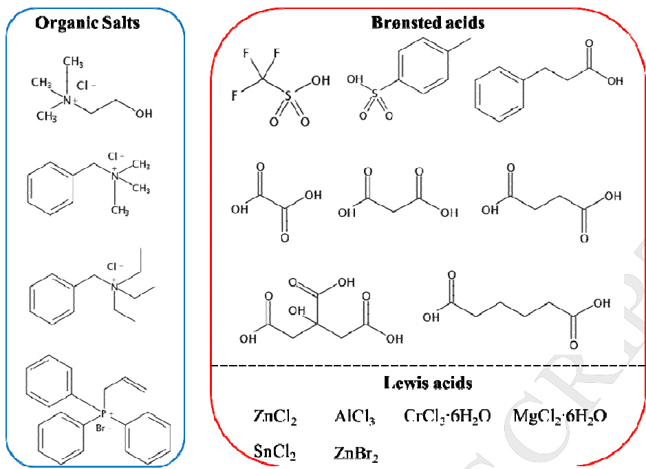  
Fig. 1. Structure of typical organic salts, organic acids and metal halides.

# 2.2 Preparation methods

Two approaches, namely the heating method and the grinding method, can be employed to synthesize ADES. The heating method involves mixing, heating and stirring until a homogenous liquid is formed, which is the most commonly used after proposed by Abbott in 2003 [11]. However, as pointed out by Florindo et al. [12], this method may lead to the formation of impurities (HCl and corresponding esters) when choosing ChCl as HBA and carboxylic acids as HBD, which might be ascribed to the too high heating temperature. Accordingly, they explored the grinding method, which integrated mixing and grinding in a mortar with a pestle at room temperature. This method has advantages in preparing DES over the traditional heating method because of the unfavorable formation of ester in the latter. Nevertheless, the heating method is still widely adopted owing to its simple operation.

Apart from the above-described methods, the so called freezing-drying method has been adopted to synthesize the DES of ChCl:2urea or ChCl:2thiourea. The general procedure is as following: Aqueous solutions of urea (or thiourea) and choline chloride in a 2:1 mole ratio and having 5 wt $\%$ solute contents were prepared by mixing separated aqueous solutions of urea (or thiourea) and ChCl. The resulting aqueous solutions were frozen and subsequently freeze-dried for the achievement of clear viscous liquids depending on the freezing temperature, respectively.[71] This method is green and easy, which is worthy of being explored as an efficient alternative to ADES preparation.

# 3. Physicochemical properties of ADES

The diverse combinations of HBD and HBA provides a flexible control over the ADES properties. As we know, to design a practical process involving ADES on an industrial scale, it is indispensable to have a comprehensive evaluation of the ADES’ physicochemical properties, thus to precisely design the task-specific catalyst and solvent. In this section, the main physicochemical properties of ADES including freezing point, acidity, viscosity, density and conductivity are described and discussed.

# 3.1 Freezing points

DES are characterized by their lower freezing points than that of the individual components. Table 2 lists the freezing points of ADES reported in literature. Especially, ADES with a freezing point lower than $5 0 ~ ^ { \circ } \mathrm { C }$ are more attractive because of the wider liquid range to act as solvents or liquid catalysts in many fields. The depression of freezing points is related to the magnitude of the interaction between

HBA and HBD, which depends on their nature structures and mole ratio.

Table 2. Reported ADES and their freezing points.   

<html><body><table><tr><td>Organic salt</td><td>Hydrogen bond donor (HBD)</td><td>Salt:HBD (mole ratio)</td><td>DES Tf (℃)</td><td>Ref</td></tr><tr><td>ChC1</td><td>adipic acid</td><td>1:1</td><td>85</td><td>[13]</td></tr><tr><td>ChCl</td><td>benzoic acid</td><td>1:1</td><td>95</td><td>[13]</td></tr><tr><td>ChC1</td><td>citric acid</td><td>1:1</td><td>69</td><td>[13]</td></tr><tr><td>ChCl</td><td>malonic acid</td><td>1:1</td><td>10</td><td>[13]</td></tr><tr><td>ChC1</td><td>oxalic acid</td><td>1:1</td><td>34</td><td>[13]</td></tr><tr><td>ChC1</td><td>phenylpropionic acid</td><td>1:1</td><td>20</td><td>[13]</td></tr><tr><td>ChC1</td><td>phenylacetic acid</td><td>1:1</td><td>25</td><td>[13]</td></tr><tr><td>ChC1</td><td>succinic acid</td><td>1:1</td><td>71</td><td>[13]</td></tr><tr><td>ChC1</td><td>tricarballylic acid</td><td>1:1</td><td>90</td><td>[13]</td></tr><tr><td>ChC1</td><td> itaconic acid</td><td>1:1</td><td>57</td><td>[17]</td></tr><tr><td>L-(+)-ChC1</td><td>tartaric acid</td><td>1:0.5</td><td>47</td><td>[17]</td></tr><tr><td>ChCl</td><td>caffeic acid</td><td>1:0.5</td><td>67</td><td>[17]</td></tr><tr><td>ChC1</td><td>4-hydroxybenzoic acid</td><td>1:0.5</td><td>87</td><td>[17]</td></tr><tr><td>ChC1</td><td> p-coumaric acid</td><td>1:0.5</td><td>67</td><td>[17]</td></tr><tr><td>(E)-ChC1</td><td>cinnamic acid</td><td>1:1</td><td>93</td><td>[17]</td></tr><tr><td>ChC1</td><td>suberic acid</td><td>1:1</td><td>93</td><td>[17]</td></tr><tr><td>ChC1</td><td> gallic acid</td><td>1:0.5</td><td>77</td><td>[17]</td></tr><tr><td>ChCl</td><td>acrylic acid</td><td>1:1.6</td><td>N/Ab</td><td>[49]</td></tr><tr><td>ChCl</td><td>methacrylic acid</td><td>1:2</td><td>N/Ab</td><td>[49]</td></tr><tr><td>ATPPB</td><td>p-toluenesulfonic acid</td><td>1:3</td><td>N/Ab</td><td>[61]</td></tr><tr><td>ChC1</td><td>trifluoromethane-sulf onic acid</td><td>1:1.5</td><td>N/Ab</td><td>[62]</td></tr><tr><td>TBAC</td><td>p-toluenesulfonic acid</td><td>1:2</td><td>N/Ab</td><td>[43]</td></tr><tr><td>TEAC</td><td>p-toluenesulfonic acid</td><td>1:2</td><td>N/Ab</td><td>[43]</td></tr><tr><td>TEAB</td><td> p-toluenesulfonic acid</td><td>1:2</td><td>N/Ab</td><td>[43]</td></tr></table></body></html>

<html><body><table><tr><td>TBAB</td><td>p-toluenesulfonic acid</td><td>1:2</td><td>N/Ab</td><td>[43]</td></tr><tr><td>ChC1</td><td>5-sulfosalicylic acid</td><td>1:2</td><td>N/Ab</td><td>[43]</td></tr><tr><td>TEAC</td><td>5-sulfosalicylic acid</td><td>1:2</td><td>N/Ab</td><td>[43]</td></tr><tr><td>ChCl</td><td> p-aminosalicylic acid</td><td>1:2</td><td>N/Ab</td><td>[43]</td></tr><tr><td>BTEAC</td><td> p-toluenesulfonic acid</td><td>3:7</td><td>2</td><td>[31]</td></tr><tr><td>BTEAC</td><td>citric acid</td><td>1:1</td><td>26</td><td>[31]</td></tr><tr><td>BTEAC</td><td>oxalic acid</td><td>1:1</td><td>5</td><td>[31]</td></tr><tr><td>BTMAC</td><td>p-toluenesulfonic acid</td><td>3:7</td><td>b</td><td>[27]</td></tr><tr><td>BTMAC</td><td>citric acid</td><td>1:1</td><td>31</td><td>[27]</td></tr><tr><td>BTMAC</td><td>oxalic acid</td><td>1:1</td><td>2</td><td>[27]</td></tr><tr><td>ChC1</td><td>ZnCl2</td><td>1:2</td><td>23-25</td><td>[18]</td></tr><tr><td>ChC1</td><td>ZnBr2</td><td>1:2</td><td>38</td><td>[19]</td></tr><tr><td>ChC1</td><td>FeCl3</td><td>1:2</td><td>65</td><td>[19]</td></tr><tr><td>ChC1</td><td>SnCl2</td><td>1:2</td><td>37</td><td>[19]</td></tr><tr><td>ChC1</td><td>CrCl3·6H2O</td><td>1:2</td><td>9</td><td>[14]</td></tr><tr><td>ChC1</td><td>MgCl2·6H2O</td><td>1:1</td><td>16</td><td>[21]</td></tr><tr><td>ZnCl2</td><td>urea</td><td>1:3.5</td><td>9</td><td>[21]</td></tr><tr><td>ZnCl2</td><td> acetamide</td><td>1:4</td><td>-16</td><td>[21]</td></tr><tr><td>ZnCl2</td><td>ethylene glycol</td><td>1:4</td><td>-30</td><td>[21]</td></tr><tr><td>ZnCl2</td><td>hexanediol</td><td>1:3</td><td>-23</td><td>[21]</td></tr><tr><td>CrCl3·6H2O</td><td>urea</td><td>2:1</td><td>9</td><td>[22]</td></tr><tr><td>ZrOCl2-8H2O</td><td>urea</td><td>1:5</td><td>-30</td><td>[23]</td></tr><tr><td>ChC1</td><td>ZnBr2</td><td>5:1</td><td>N/Ab</td><td>[54]</td></tr><tr><td>FeCl3·6H2O</td><td>ethylene glycol</td><td>2:1</td><td>-64a</td><td>[63]</td></tr><tr><td>FeCl3-6H2O</td><td> glycerol</td><td>3:1</td><td>-66a</td><td>[63]</td></tr><tr><td>FeCl3·6H2O</td><td>malonic acid</td><td>2:1</td><td>-63a</td><td>[63]</td></tr><tr><td>FeCl3·6H2O</td><td> pentaerythritol</td><td>2:1</td><td>-60²</td><td>[63]</td></tr><tr><td>FeCl3·6H2O</td><td>xylitol</td><td>2:1</td><td>-55a</td><td>[63]</td></tr><tr><td>FeCl3·6H2O</td><td> serine</td><td>2:1</td><td>-56a</td><td>[63]</td></tr><tr><td>FeCl3·6H2O</td><td> alanine</td><td>2:1</td><td>-63a</td><td>[63]</td></tr></table></body></html>

<html><body><table><tr><td>FeCl3·6H2O</td><td> glycine</td><td>2:1</td><td>-65a</td><td>[63]</td></tr><tr><td>ZrOCl2·8H2O</td><td>urea</td><td>1:5</td><td>-30</td><td>[57]</td></tr><tr><td>ZrOCl2-8H2O</td><td>ethylene glycol</td><td>1:2</td><td>5.36a</td><td>[57]</td></tr><tr><td>ZrOCl2-8H2O</td><td>glycerol</td><td>1:2</td><td>8.75a</td><td>[57]</td></tr></table></body></html>

Glass-transition temperature, Tg.

b “N/A” denotes “not available”.

The typical phase diagram of BADES is exhibited in Fig. 2. The mole ratio of HBA to HBD has a significant effect on the DES freezing points, and the lowest freezing point depend on the nature of HBD species. When monoacids, e.g. phenylpropionic acid (PPA) and phenylacetic acid (PAA), were used as HBD to prepare BADES with ChCl, the eutectic occurred at a composition of $67 \mathrm { m o l } \%$ acid to form ChCl:2PPA and ChCl:2PAA (Fig. 2a). Therefore, two carboxylic acid molecules are required to complex one chloride ion. On the contrast, in the case of dicarboxylic acid-based BADES, the eutectic compositionof $50 \mathrm { m o l } \%$ acid suggests a 1:1 complex between the HBD and chloride (Fig. 2b). It seems that the freezing point has certain correlation with the molecular weight of organic acids (HBD), the lower one leads to the larger depression of freezing point [13].

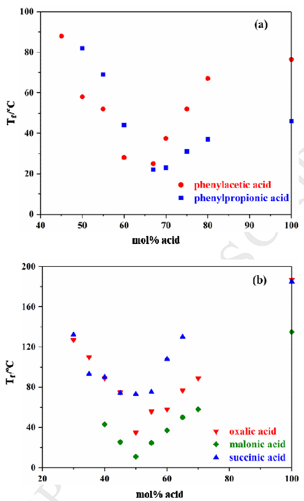  
Fig. 2. Freezing points of BADES composed of ChCl and carboxylic acids as a function of composition. (Reprinted with permission from Ref. [13]. Copyright (2004) American Chemical Society.)

For LADES, most of them have the similar phase diagram as shown in Fig. 3. It should be noted that the crystal water in LADES are of vital importance, for instance, adding anhydrous $\mathrm { C r C l } _ { 3 }$ instead of $\mathrm { C r C l } _ { 3 }$ · $\mathrm { 6 H } _ { 2 } \mathrm { O }$ cannot form liquid with ChCl, and the anhydrous salt cannot dissolve in the resultant DES  from the hydrated salt. The water molecules are either coordinated to the chrome center or associated with the free chloride ions, and they actually behave as ligands rather than solvent molecules [14].

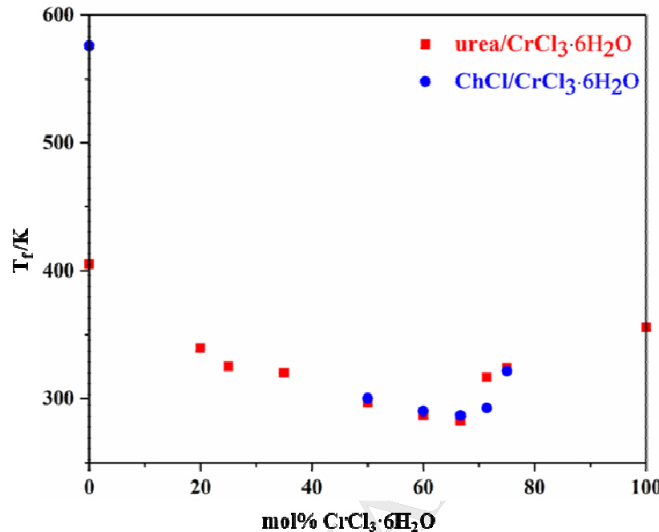  
Fig. 3. Melting points of urea: $\mathrm { C r C l } _ { 3 }$ · $6 \mathrm { H } _ { 2 } \mathrm { O }$ and ChCl:CrCl3· $6 \mathrm { H } _ { 2 } \mathrm { O }$ as a function of composition. (Reprinted with permission from Ref. [22]. Copyright (2014) Royal Society of Chemistry.)

Apart from the above phase behaviors, Qin et al. [15] synthesized the acid-base tunable DES by imidazole (Im) and PTSA with two eutectic compositions. As depicted in Fig. 4, the freezing points of Im-PTSA mixtures change notably by varying the Im to PTSA mole ratio, and a binary eutectic phase diagram with two regions of DES is observed, which is divided by the equimole salt at Im to PTSA ratio of 1:1. Accordingly, two representative eutectic points are observed at Im to PTSA ratio of 3:1 $( 9 . 5 6 ~ ^ { \circ } \mathrm { C } )$ and 1:2 $( 4 5 . 4 8 ~ ^ { \circ } \mathrm { C } )$ , respectively. The DES 3Im:PTSA shows weak basicity while Im:2PTSA possesses strong acidity. The formation mechanism for this special case was proposed that Im first reacts with PTSA to form equimolar salt; then the salt plays the role of HBA toto further interact with Im or PTSA through hydrogen bond to form the corresponding DES.

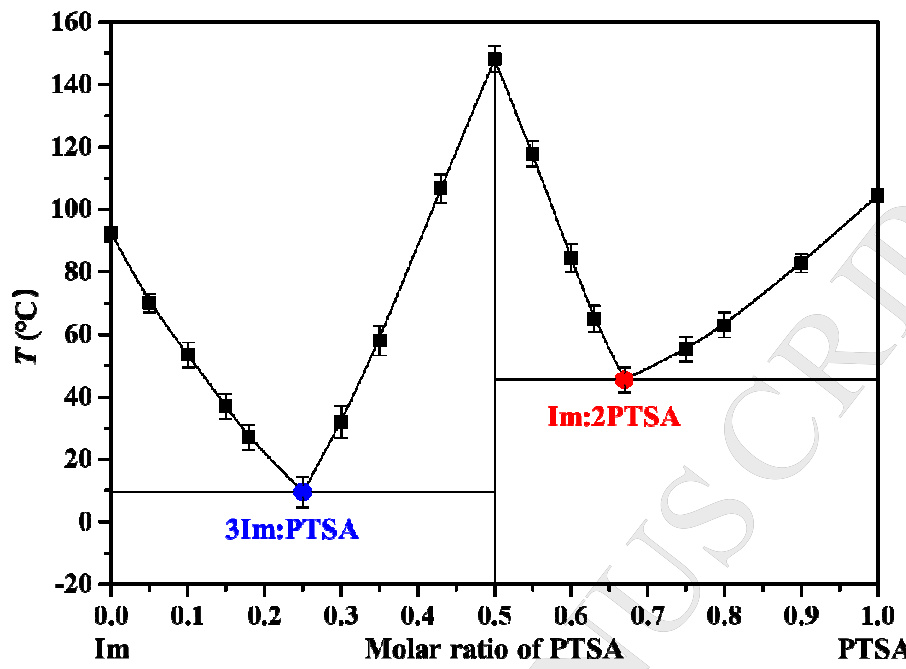  
Fig. 4. Freezing points of acid-base tunable DES formed by Im and PTSA. (Reprinted with permission from Ref. [15]. Copyright (2018) Wiley-VCH.)

Despite these, up to now, it still remains unclear about the exact correlation between the freezing point of DES and the melting point of the pure components [16]. However, Abbott et al. proposed that the freezing points of HBD-salt eutectic mixtures rely on the lattice energies of the salt and HBD, the way how the couple anion-HBD interacts, as well as the entropy changes stemming from forming a liquid phase.

# 3.2 Acidity

The acidity of ADES can be designed and controlled according to the acidity of HBD. Determination of acidity is crucial when employing ADES as solvent and catalyst in many cases, especially in the esterification and transesterification process [24]. For BADES, the Brønsted acidity strength can be evaluated by measuring the pH or the Hammett acidity function. For LADES, the Lewis acidity can be determined by FT-IR investigation, where pyridine is used as probe molecule to monitor the bands in the range of $1 4 0 0 { - } 1 7 0 0 \ \mathrm { c m } ^ { - 1 }$ stemming from its ring vibration modes [25,26].

pH is widely used to evaluate the acidity of BADES. Taysun et al. [27] investigated the $\mathrm { \ p H }$ of benzyl tri-methyl ammonium chloride (BTMAC) based DES with different organic acids as HBD. As shown in Fig. 5, the chemical nature of HBDs has a crucial effect on the acidity strength of the corresponding BADES. The pKa of the studied HBDs follows a sequence of $p$ -toluenesulfonic acid (PTSA) (-2.8) $\prec$ oxalic acid (OX) (1.25) $\prec$ citric acid (CA) (4.14), which is in accordance with the acidity order of the resultant BADES (3BTMAC:7PTSA $>$ BTMAC:OX > BTMAC:CA). Moreover, from these pH curves, it is clear that temperature has a weak influence on the pH values. BTMAC:CA and BTMAC:OX show rather stable pH values; while the pH of 3BTMAC:7PTSA slightly decrease with raising temperature towing to the higher dissociation of the acid at high temperature.

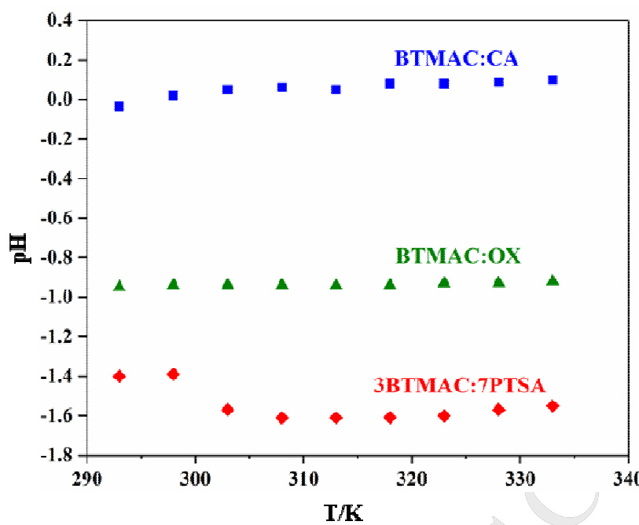  
Fig. 5. pH for different BADES as a function of temperature. (Reprinted with permission from Ref. [27]. Copyright (2016) Elsevier.)

Hammett acidity function $( H _ { O } )$ , relying on UV-visible spectrophotometry with a basic indicator in water, is another approach to evaluate the acidity of BADES, which is calculated by the following equation:

I represents indicator, and pK(I) is the thermodynamic ionization constant of the indicator in water. The [I]/[IH ] ratio can be determined from the absorbance measured before and after the addition of BADES. Cui et al. [10] synthesized four ChCl-based BADES and investigated their Brønsted acidities by Hammett acidity functions with 4-nitroaniline as the indicator at 293.15 K. The $H _ { O }$ values of these BADES are shown in Table 3, ranging from 0.87 to 2.23. The acidity of these BADES rank as ChCl:2PTSA $>$ ChCl:2TCA $>$ ChCl:2MCA $>$ ChCl:2PA. ChCl:2PTSA possess the highest acidity due to the higher acidity of PTSA, which can also manifest the pivotal role of HBD in assessing the acidity of BADES.

Table 3. Hammett acidity functions of BADES $4 0 . 0 \mathrm { m m o l } \$ ) in water at 293.15 K. (Reprinted with permission from Ref. [10]. Copyright (2017) Elsevier.)   

<html><body><table><tr><td>DES</td><td>Amax</td><td>[1]%</td><td>[IH]%</td><td>H</td></tr><tr><td>-</td><td>1.055</td><td>100</td><td>0</td><td></td></tr><tr><td>ChCl:2PTSA</td><td>0.456</td><td>43.2</td><td>56.8</td><td>0.87</td></tr><tr><td>ChCl:2TCA</td><td>0.508</td><td>48.2</td><td>51.8</td><td>0.96</td></tr><tr><td>ChCl:2MCA</td><td>0.790</td><td>74.9</td><td>25.1</td><td>1.46</td></tr><tr><td>ChCl:2PA</td><td>0.998</td><td>94.6</td><td>5.4</td><td>2.23</td></tr></table></body></html>

Duan et al. [28] investigated the Lewis acidity of four kinds of LADES. Pyridine was added to ChCl: $x Z \mathrm { n C l } _ { 2 }$ and BTMAC:2ZnCl2 for FT-IR scanning. The band around $1 4 5 0 ~ \mathrm { c m } ^ { - 1 }$ suggests the pyridine coordination to Lewis acid sites; while the band near $1 5 4 0 ~ \mathrm { c m } ^ { - 1 }$ reflects the formation of pyridinium ions due to the existence of Brønsted acidic sites. [25] The increase of the bond wavenumber near $1 4 5 0 ~ \mathrm { c m } ^ { - 1 }$ reflects the enhancement of the Lewis acidity. From Fig. 6, pure pyridine (a) represents a well resolved single band at $1 4 3 7 ~ \mathrm { { c m } ^ { - 1 } }$ . However, in $\mathbf { C h C l : } x \mathbf { Z n C l } _ { 2 }$ (b-d, $\scriptstyle \mathbf { X } = 1 - 3$ ) or BTMAC:2ZnCl2 (e), the red shifts from 1437 to $1 4 4 8 ~ \mathrm { { c m } ^ { - 1 } }$ indicates the coordination of pyridine to Lewis acid sites. The same band shifts of pyridine molecule in these LADES reflect that they have similar Lewis acid strength. Moreover, no Brønsted acid site was observed in $\mathbf { C h C l : } x \mathbf { Z n C l } _ { 2 }$ and BTMAC: $2 \mathrm { Z n C l } _ { 2 }$ since no band appeared at approximately $1 5 4 0 \mathrm { c m } ^ { - 1 }$ .

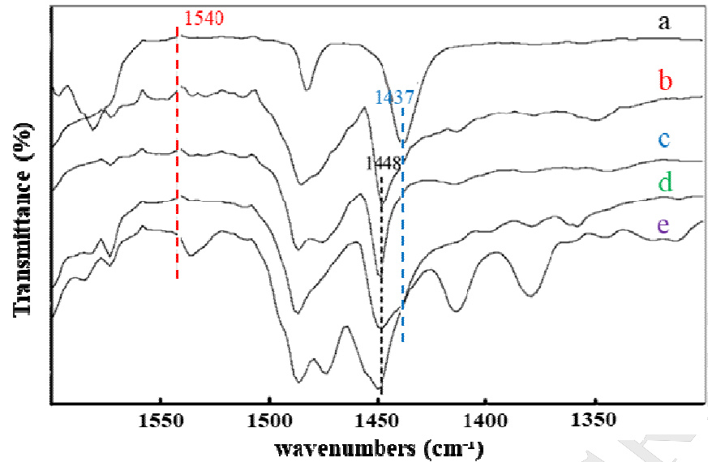

Fig. 6. FT-IR of: (a) pyridine; (b) pyridine $^ +$ choline chloride: $\mathrm { { Z n C l } } _ { 2 }$ ; (c) pyridine $^ +$ choline chloride: $2 Z \mathrm { n C l } _ { 2 }$ ; (d) pyridine $^ +$ choline chloride: $3 Z \mathrm { n C l } _ { 2 }$ ; and (e) pyridine $^ +$ BTMAC:2ZnCl2 (pyridine:DES $\mathbf { \tau } = \mathbf { \tau }$ 1:3in b–e, weight ratio). (Reprinted with permission from Ref. [28]. Copyright (2006) Elsevier.)

# 3.3 Density

Density is a very basic and important physical property for a solvent. Generally, the ADES exhibit higher densities than water. Table 4 lists selected physical properties of various ADES at the eutectic composition at $2 9 8 . 1 5 \mathrm { ~ K ~ }$ . Based on the density data, the thermal expansion coefficient $( a )$ , molecular volume $( V _ { m } )$ , standard mole entropy (S), and lattice energy $( U _ { P O T } )$ can be calculated by the following equation:

$$
\ln \rho = b - \alpha \cdot T
$$

$$
V _ { \mathrm { { m } } } = M \mathrm { { } } / \left( N \cdot \rho \right)
$$

$$
S ^ { 0 } = 1 2 4 6 . 5 \cdot ( V _ { m } ) + 2 9 . 5
$$

$$
U _ { _ { P O T } } = 1 9 8 1 . 2 \cdot ( \rho / M ) ^ { 1 / 3 } + 1 0 3 . 8
$$

The $ { \boldsymbol { a } }$ value reflects the free volume of ADES, which is in the range of $5 \times { 1 0 } ^ { - 4 }$ and 7 $\times 1 0 ^ { - 4 } \mathrm { K } ^ { - 1 }$ obtained by Jacquemin [29]. $U _ { P O T }$ is reflected by the strength of interactions

between ions, which was calculated based on the Glasser theory [30].

Table 4. Physical properties of ADES at $2 9 8 . 1 5 \mathrm { K }$ .   

<html><body><table><tr><td>Salts</td><td>HBD</td><td>Salt : HBD (mol : mol)</td><td>Density (p，g/cm³)</td><td>Viscosity (cP)</td><td>Conductivity (mS/cm-1)</td><td>Ref.</td></tr><tr><td>ZnCl2</td><td>Urea</td><td>1:3.5</td><td>1.63</td><td>11340</td><td>0.18 (315.15K)</td><td>[21]</td></tr><tr><td>ZnCl2</td><td>Acetamide</td><td>1:4</td><td>1.36</td><td></td><td></td><td>[21]</td></tr><tr><td>ZnCl2</td><td>Ethylene glycol</td><td>1:4</td><td>1.45</td><td></td><td></td><td>[21]</td></tr><tr><td>ZnCl2</td><td>Hexanediol</td><td>1:3</td><td>1.38</td><td></td><td></td><td>[21]</td></tr><tr><td>ChCl</td><td>ZnCl2</td><td>1:2</td><td></td><td>85000</td><td>0.06 (313.15K)</td><td>[19]</td></tr><tr><td>ChC1</td><td>CrCl3·6H2O</td><td>1:2</td><td></td><td>2346</td><td>0.37</td><td>[14]</td></tr><tr><td>ChC1</td><td>Malonic acid</td><td>1:2</td><td>1.25</td><td>721</td><td>0.55</td><td>[13]</td></tr><tr><td>ChC1</td><td>p-Toluenesulfonic acid</td><td>1:2</td><td>1.24</td><td>697.9</td><td>0.62</td><td>[10]</td></tr><tr><td>ChC1</td><td>Trichloroacetic acid</td><td>1:2</td><td>1.46</td><td>434.99</td><td>0.071</td><td>[10]</td></tr><tr><td>ChCl</td><td>Monochloroacetic acid</td><td>1:2</td><td>1.28</td><td>117.93</td><td>0.32</td><td>[10]</td></tr><tr><td>ChC1</td><td>Propionic acid</td><td>1:2</td><td>1.08</td><td>55.909</td><td>0.39</td><td>[10]</td></tr><tr><td>BTEAC</td><td>p-Toluenesulfonic acid</td><td>3:7</td><td>1.1684</td><td>12698</td><td>0.041</td><td>[31]</td></tr><tr><td>BTEAC</td><td>Oxalic acid</td><td>1:1</td><td>1.1723</td><td>41080</td><td>1.21</td><td>[31]</td></tr><tr><td>BTEAC</td><td>Citric acid</td><td>1:1</td><td></td><td></td><td>0.002</td><td>[31]</td></tr><tr><td>FeCl3·6HO</td><td>ethylene glycol</td><td>2:1</td><td>1.605</td><td>43.37</td><td>45.4</td><td>[62]</td></tr><tr><td>FeCl3·6HO</td><td> glycerol</td><td>3:1</td><td>1.637</td><td>99.16</td><td>26.8</td><td>[62]</td></tr><tr><td>FeCl3·6H2O</td><td>malonic acid</td><td>2:1</td><td>1.619</td><td>33.16</td><td>108.3</td><td>[62]</td></tr><tr><td>FeCl3-6H2O</td><td> pentaerythritol</td><td>2:1</td><td>1.599</td><td>176.49</td><td>24.5</td><td>[62]</td></tr><tr><td>FeCl3·6H2O</td><td> xylitol</td><td>2:1</td><td>1.630</td><td>446.54</td><td>10.1</td><td>[62]</td></tr><tr><td>FeCl3·6H2O</td><td>serine</td><td>2:1</td><td>1.670</td><td>380.89</td><td>19.4</td><td>[62]</td></tr><tr><td>FeCl3·6H2O</td><td>alanine</td><td>2:1</td><td>1.628</td><td>119.75</td><td>37.4</td><td>[62]</td></tr><tr><td>FeCl3-6HO</td><td>glycine</td><td>2:1</td><td>1.677</td><td>156.62</td><td>43.9</td><td>[62]</td></tr></table></body></html>

<html><body><table><tr><td>ZrOCl2-8H2O</td><td>urea</td><td>1:5</td><td>1.49</td><td>52.40</td><td>[57]</td></tr><tr><td>ZrOCl2-8H2O</td><td>ethylene glycol</td><td>1:2</td><td>1.57</td><td>149.50</td><td>[57]</td></tr><tr><td>ZrOCl2:8H2O</td><td>glycerol</td><td>1:2</td><td>1.57</td><td>532.73</td><td>[57]</td></tr></table></body></html>

# 3.4 Viscosity

Similar to ILs and other DES, most ADES have a relatively high viscosity (η) (> 100 cP) at room temperature, which is generally attributed to the presence of extensive hydrogen bond network and its influence on the mobility of free species within the ADES. Besides, two additional factors, including large ion size and small void volume of ADES as well as electrostatic or van der Waals interactions, can account for the high viscosity. In practical process, ADES with lower viscosity is urgently desirable because of their promising applications as green media, which can be designed under the guidance of the Hole theory. Selection of small cations or fluorinated hydrogen-bond donors is favorable to form DES with low viscosity [32].

# 3.5 Conductivity

Analogous to the viscosity, conductivity of ADES increase remarkably with temperature resulting from the enhanced kinetic energy of molecules and increased collision frequency between molecules. The Arrhenius-like equation is applicable to predict the conductivity behavior of ADES:

$$
\ln \sigma = \ln \sigma _ { \scriptscriptstyle 0 } + \frac { E _ { \scriptscriptstyle \Lambda } } { R T }
$$

where $\sigma$ is the ionic conductivity, $\sigma _ { 0 }$ is the ionic conductivity constant.

In addition, based on the Walden rule, the relationship between ionic conductivity and viscosity can be described by the Walden plot, as shown by the

following equations:

$$
\Lambda \eta ^ { \alpha } = k
$$

$$
\log \Lambda = \log k + \alpha \log \eta ^ { - 1 }
$$

where $\Lambda$ is the mole conductivity, $\eta$ is the dynamic viscosity, and $k$ is a temperature dependent constant. The Walden plots of ADES can be compared to the $^ { 1 \mathbf { M } }$ aqueous KCl solution, which represents the independent ions within the solution without interionic interactions [33,34]. From Fig. 7, all of the Walden plots are under the ideal line except ChCl:2PTSA. The lines of ChCl:2TCA, ChCl:2MCA and ChCl:2PA lie below the ideal KCl line, which indicates that they are “subionic”. By contrast, the line of ChCl:2PTSA lie near the ideal line, so it can be classified as “ionic”. [10,35,36]

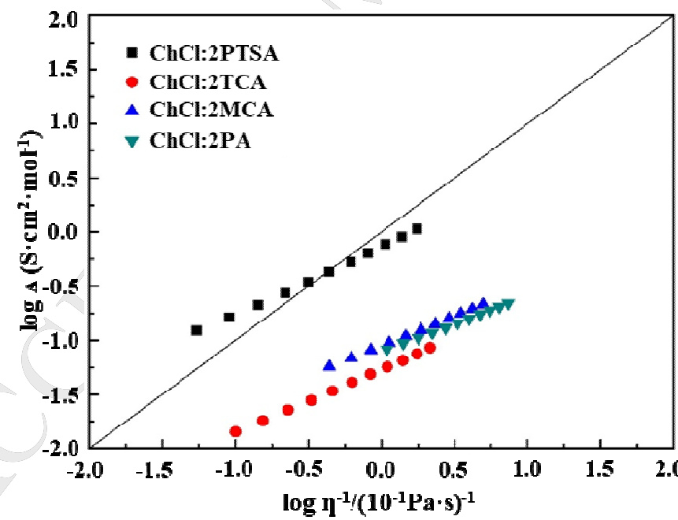

Fig. 7. Plot of logΛ versus $\boldsymbol { \mathrm { l o g } \eta } ^ { - 1 }$ for BADES from 288.15 to $3 3 8 . 1 5 \mathrm { ~ K ~ }$ . The solid straight line is the ideal line for aqueous KCl solutions. (Reprinted with permission from Ref. [10]. Copyright (2017) Elsevier.)

# 4. Applications of BADES

In this section, we introduce the applications of BADES from the perspectives of dissolution, extraction and reaction. BADES possess excellent dissolution properties owing to their ability of donating protons or accepting electrons to form hydrogen bonds [37]. Besides, due to their low cost and green affiliation, BADES have been widely applied in extraction and separation for high purity product. Furthermore, the bifunctional or multifunctional roles of BADES in organic reactions, aiming to completely replace the traditional hazardous solvents and catalysts, are getting more and more attention.

# 4.1 Dissolution in BADES

# 4.1.1 Dissolution of metal oxides

In 2003, Abbott et al. [13] first demonstrated the possibility of the dissolution of metal oxides in BADES. From Table 5, high solubility of $\mathrm { { } } Z \mathrm { { n O } }$ , $\mathtt { C u O }$ , and $\mathrm { F e } _ { 3 } \mathrm { O } _ { 4 }$ in BADES can be achieved at $5 0 ~ ^ { \circ } \mathrm { C }$ ; however, their solubility in each BADES is remarkably different. For instance, $\mathrm { F e } _ { 3 } \mathrm { O } _ { 4 }$ is most soluble in ChCl:oxalic acid, whereas it is almost 20 times less soluble in ChCl:2phenylpropionic acid. Other oxides, such as aluminates and silicates, are found to be insoluble in the studied BADES. The difference of solubility of metal oxides can be utilized for the selective recovery of metals.

Table 5. Solubility of $\mathrm { { z n O } }$ , CuO, and $\mathrm { F e } _ { 3 } \mathrm { O } _ { 4 }$ in BADES at $5 0 ^ { \circ } \mathrm { C }$ . (Reprinted with permission from Ref. [13]. Copyright (2004) American Chemical Society.)   

<html><body><table><tr><td>BADES</td><td>Solubility (mol L-1)</td></tr><tr><td></td><td></td></tr><tr><td></td><td></td></tr><tr><td></td><td></td></tr><tr><td></td><td></td></tr><tr><td></td><td></td></tr><tr><td></td><td></td></tr></table></body></html>

<html><body><table><tr><td></td><td>CuO</td><td>FeO4</td><td>ZnO</td></tr><tr><td>ChCl:malonic acid</td><td>0.246</td><td>0.071</td><td>0.554</td></tr><tr><td>ChCl:oxalic acid</td><td>0.071</td><td>0.341</td><td>0.491</td></tr><tr><td>ChCl:2phenylpropionic acid</td><td>0.473</td><td>0.014</td><td>>0.491</td></tr></table></body></html>

In 2006, Abbott et al. [38] systematically investigated the solubility of 17 commonly available metal oxides in ChCl based DES, where urea, malonic acid, and ethylene glycol were used as HBDs respectively. Metal oxides with a high ionic nature such as $z _ { \mathrm { { n O } } }$ were highly soluble. Conversely, more covalent oxides such as $\mathrm { T i O } _ { 2 }$ exhibit negligible solubility. Moreover, temperature has a strong influence on the solubility of metal oxides in DES, especially $\mathrm { C u } _ { 2 } \mathrm { O }$ and ZnO. To sum up, malonic acid based BADES provides higher solubility than urea and ethylene glycol based DES, which can be ascribed to the protons serving as good oxygen acceptors and leading to chlorometalate species.

# 4.1.2 Dissolution of organic macromolecules

Starch is one of the cheapest and most cost-effective industrial materials, which are often modified to improve its end-use properties. However, the poor solubility of starch in organic solvents has become the major hurdle. Biswas et al. [39] found that the starch can dissolve in ADES of ChCl:oxalic acid or $\mathbf { C h C l : } 2 \mathbf { Z n C l } _ { 2 }$ in $5 \mathrm { - } 1 0 \%$ concentration. However, it cannot dissolve in BADES of ChCl:succinic acid, ChCl: maleic acid, and ChCl: phenylacetic acid (turbid suspensions).

Morrison et al. [40] investigated the dissolution of five poorly soluble drugs in DES ChCl:2urea and ChCl:malonic acid, namely benzoic acid, griseofulvin, danazol, itraconazole and

N-[4-[[6-[4-(trifluoromethyl)phenyl]4-pyrimidinyl]oxy]-2-benzothiazolyl]acetamide (AMG517). From Table 6, DES can improve the solubility by 5 to 22,000 times as compared with their solubility in water. For BADES ChCl:malonic acid, it shows significantly higher solubility of danazol, itraconazole, AMG517 and griseofulvin. Although benzoic acid dissolves more in basic DES ChCl:2urea, its solubility in ChCl:malonic acid is still relatively high of $3 5 \mathrm { \ m g / m L }$ . Due to the low toxicity of DES, they have the potential to act as vehicle for oral dosing of rats during early development pharmacokinetic investigations.

Table 6. Solubility data of drugs in ChCl:malonic acid, ChCl:2urea and water. (Reprinted with permission from Ref. [40]. Copyright (2009) Elsevier.)   

<html><body><table><tr><td rowspan="2">Solvents</td><td colspan="4">Drug solubility (mg/mL)</td></tr><tr><td>Benzoic acid</td><td>Danazol GriseofulvinAMG517</td><td></td><td>Itraconazole</td></tr><tr><td>ChCl:malonic acid</td><td>35</td><td>0.16</td><td>1 0.4727</td><td>22</td></tr><tr><td>ChCl:2urea</td><td>229</td><td>0.048 0.034</td><td>0.010</td><td><0.001</td></tr><tr><td>water</td><td>3</td><td><0.0005 0.007</td><td><0.0001</td><td><0.001</td></tr></table></body></html>

# 4.1.2 Dissolution of cellulose

Renewable cellulose has been found as the most abundant material in lignocellulose biomass, which has the enormous potentials to be transformed into valuable products. However, its water-insoluble crystalline structure together with the highly packed polymetric macromolecules have all restricted the succedent widespread applications because of its poor dissolution in the conventional solvents. Ren et al. [72] synthesized a novel functional deep eutectic solvent by mixing ally triethyl ammounium chloride ([ATEAm]Cl) with oxalic acid in a 1:1 molar ratio, to highly dissolve the cellulose of $6 . 4 8 ~ \mathrm { w t } \%$ . It has been discovered that the π-π conjugative effect resulting from the ally group leads to the charge delocalization of $\mathrm { [ A T E A m ] ^ { + } }$ . As a result, the solvation properties and viscosity were highly improved to remarkably increase the dissolution of cellulose in DES.

# 4.2 Extraction by BADES

# 4.2.1 Extraction of phenolic compounds

The extraction of phenolic compounds has aroused much attention because of their important biological properties including anti-inflammatory, antiviral, analgesic, anticarcinogenic, antimicrobial (antifungal and antiviral), and antioxidant activities. It has been discovered that the hydrogen bond interactions between DES molecules and phenolic compounds are responsible for the high extractability.

Li et al. [41] developed the efficient extraction of major catechins from Camellia sinensis leaves with the assistance of microwave using BADES of ChCl:lactic acid.. The extraction parameters were optimized combined Box-Behnken design with response surface methodology to obtain the best extraction performance of $1 5 3 . 7 \pm$ $5 . 2 ~ \mathrm { m g { \cdot g } ^ { - 1 } }$ . The separation of catechins from DES-based extraction solution can be easily reached by AB-8 macroporous resin with high recovery yields from $7 5 . 2 \%$ to $8 6 . 1 \%$ .

Bosiljkov et al. [42] established an environmentally friendly extraction method to recovery the anthocyanins in wine lees with the assistance of ultrasound. The type of DES strongly influence the anthocyanin extraction, resulting in the sequence of

ChCl:malic acid $>$ ChCl:oxalic acid $>$ ChCl:citric acid $>$ ChCl:glucose > ChCl:fructose $>$ ChCl:xylose $>$ ChCl:glucose. Taking the organic acids as HBD will benefit the extraction since the acidic conditions can stabilize the flavylium ion so as to favor the anthocyanin extraction and stability. The extraction optimization was carried out  by response surface methodology to obtain an optimal condition: extraction time of $3 0 . 6 \ \mathrm { m i n }$ ; ultrasound power of 341.5 W; and water content in NADES of $3 5 . 4 ~ \mathrm { w t } \%$ .

# 4.2.2 Extraction desulfurization

Another hot topic is the oxidation/extraction desulfurization process due to the stringent requirements on sulfur content in fuels. Yin et al. [43] synthesized a variety of BADES with different acidities to probe their oxidation/extraction desulfurization capability. To sum up, the acidity of BADES shows a positive correlation with the desulfurization performance. Under optimal conditions, the desulfurization eciencies of ChCl:2PTSA and TBAC:2PTSA can reach up to $9 9 . 9 9 \%$ for model oils and as high as $9 7 . 2 5 \%$ and $9 5 . 9 0 \%$ for real fuels respectively, which present the distinctive advantages over those acquired by conventional ionic liquids.

Li et al. [44] performed the extractive desulfurization of thiophene (TS), dibenzothiophene (DBT), and benzothiophene (BT) in model oil using carboxylic acid-based BADES with tetrabutylammonium bromide (TBAB) as HBA. TBAB:HCOOH possesses the most effective ability to remove the sulfur compounds from the fuels, and the desulfurization efficiencies of BT, DBT, and TS can respectively reach $8 1 . 7 5 \%$ , $8 0 . 4 7 \%$ , and $7 2 . 0 0 \%$ in a single stage at the optimized conditions of $4 0 ~ \mathrm { m i n }$ , $3 0 ~ ^ { \circ } \mathrm { C }$ , and a mass ratio of 1:0.5 (DES/oil). The desulfurization mechanism was discussed to prove that hydrogen bond is the main driving force of the extraction desulfurization process. The BADES can be regenerated by back-extraction with methyl tert-butyl ether as extractant.

# 4.3 Reaction in BADES

# 4.3.1 Synthesis of 5-HMF

5-hydroxymethylfurfural (5-HMF) is regarded as an important building block platform to produce high-value chemicals and biofuel molecules. It is often prepared by the dehydration of glucose or fructose in the presence of acid catalyst [45].

Assanosi et al. [46] reported the use of an environmentally friendly BADES for the dehydration of fructose to 5-HMF, which consists of ChCl and PTSA at different mole ratio. The BADES acts as the dual role of solvent and catalyst without the utilization of external organic solvent or acid catalyst. ChCl:PTSA possesses the best performance to achieve $9 0 . 7 \%$ product yield at the feed ratio of $2 . 5 ~ \mathrm { w t } \%$ , $8 0 ~ ^ { \circ } \mathrm { C }$ and 1 h.

Because of the acid-catalyzed mechanism of both hydrolysis of inulin and dehydration of fructose, these two processes can be integrated in one pot. Hu et al. [47] conducted the efficient one-pot reaction for the conversion of inulin into 5- HMF with ChCl:oxalic acid and ChCl:citric acid as catalysts and solvents. In the presence of ChCl:citric acid, the yield $57 \%$ and selectivity $65 \%$ to 5-HMF can be achieved when inulin was first stirred at $5 0 ~ ^ { \circ } \mathrm { C }$ for $2 \mathrm { ~ h ~ }$ , then at $8 0 ~ ^ { \circ } \mathrm { C }$ for the next $2 \mathrm { ~ h ~ }$ . Moreover, the biphasic system consisting of ethyl acetate and ChCl:oxalic acid was designed to improve the product yield to $64 \%$ . The BADES phase can be recycled directly for 6 times after removing the organic phase containing 5-HMF, without the considerable reduction in product yield.

# 4.3.2 Esterification reaction

Organic esters have been widely used as reaction intermediates, solvents and food additives. The traditional synthetic process by the Fisher esterification with sulfuric acid as catalyst suffers from several problems of side reaction, severe equipment corrosion, and acidic waste emission [48]. To overcome the above drawbacks, BADES has aroused much attention in recent years. Due to the polarity difference of specific ester and BADES, the automatic separation of product and BADES can be achieved to benefit the recovery process. The product ester can be in-situ removed from the reaction system to break the chemical equilibrium to increase the reactant conversion.

Sunitha et al. [49] prepared novel halogen-free BADES by mixing four new quaternary ammonium methanesulfonate salts with PTSA, which acted as both solvent and catalyst for esterification of several carboxylic acids with different alcohols. The operating conditions are mild and the process is safe and simple. Easy recovery and reusability of DES with high activity makes this method efficient and eco-friendly.

Qin et al. [15] first synthesized the acid-base tunable DES by imidazole (Im) and PTSA without the utilization of halogen atom or organic salt, where the BADES Im:2PTSA was selected as the dual solvent and catalyst for preparing long-chain ester in reactive extraction process (Fig. 9). The dual functions of Im:2PTSA were evaluated by $\sigma$ -potential analysis and esterification experiments. The conversion of reactant isobutanol can reach $9 2 . 5 0 ~ \%$ at the optimized conditions of 1.2:1 acid to alcohol, $8 0 ~ ^ { \circ } \mathrm { C }$ and $20 \mathrm { w t } \%$ BADES dosage in 2h.

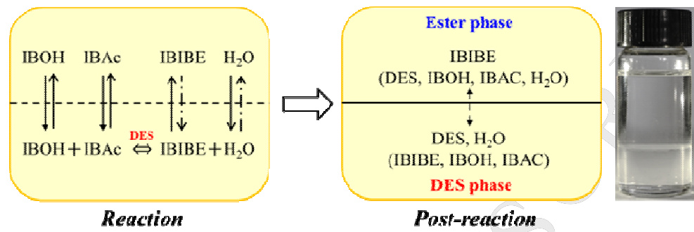

Fig. 8. Concept of reactive extraction process for synthesizing long-chain ester isobutyl isobutyrate. (Reprinted with permission from Ref. [15]. Copyright (2018) Wiley -VCH.)

# 4.3.3 Frontal polymerization reaction

In comparison with the traditional polymerizations, the self-propagating nature of frontal polymerizations (FPs) can reduce energy costs in polymer preparation and provide high conversion rate at shorter reaction times. However, it is much difficult to control the temperature at the front, thus confine its practical implementation. Mota-Morales et al. [50] described the use of BADES for FPs, which are prepared by acrylic acid (AA) or methacrylic acid (MAA) and ChCl. The tailored BADES of ChCl:1.6AA and ChCl:2MAA exhibit high viscosities ( $1 1 5 \ \mathrm { c P }$ and $1 9 3 \ { \mathrm { c P } } _ { , }$ ), which offer the possibility of controlling the front temperature and velocity to stabilize the polymerization front. The conversion of acrylate and methacrylate are up to $7 5 \%$ and $8 5 \%$ in ChCl:1.6AA and ChCl:2MAA, respectively. After dilution in water, the resulting poly (acrylic acid) can be easily recovered and the ChCl can be recycled.

# 4.4 Ionothermal Synthesis of Materials.

# 4.4.1 Synthesis of cobalt aluminophosphate (CoAlPO)

Drylie et al. [73] employed three different BADES consisting of ChCl and carboxylic acids (succinic acid, glutaric acid, and citric acid) to synthesize the unusual aluminophosphate layered materials, where the terminal Co-Cl bonds are formed by the ordered cobalt atoms. Because of the sensitivity of Co-Cl units to hydrolysis in the existence of excess water, they are unlikely to be accessible using the traditional approaches of hydrothermal method. The dense aluminophosphate phases such as berlinite can be successfully prepared with help of bases including syclam or pyridine to control the acid-base property of the solvent system. A novel CoAlPO structure of SIZ-13 was prepared using the modified carboxylic acids-based BADES, which has 4.4.2 Synthesis of novel layered zinc phosphate

Liu et al. [74] synthesized a novel layered zinc phosphate, namely [N2C6H12]2[Zn7H3(HPO4-x)5(PO4)3] (ZnPO-DES1), by the inothermal method from the system containing BADES of TPABr:oxalic acid, zinc acetate, $\mathrm { H } _ { 3 } \mathrm { P O } _ { 4 }$ , and triethanolamine (TEA) at $1 5 0 { - } 1 8 0 \ ^ { \circ } \mathrm { C }$ for 3 days. The structure of this material is composed of 10-membered-ring ellipsoidal channels running perpendicularly to ladder-shaped layers. The authors found that 1,4-diazabicyclo[2,2,2,2]octane (DABCO) can be generated during the preparation process of this material by TEA transformation and acted as the template of zincophosphate structure.

# 5. Applications of LADES

Many efforts have been made to employ the LADES in organic reactions to make the chemical process economical and green. In the following section, we will present the applications of type , , and $\boxed { \begin{array} { r l } \end{array} }$ LADES, mainly centering on the organic reactions as well as referring to the metal electrodeposition.

# 5.1 Applications of Type $\boxed { \begin{array} { r l } \end{array} }$ LADES

# 5.1.1 ChCl and ZnCl2 based LADES

$\mathbf { C h C l : } 2 \mathbf { Z n C l } _ { 2 }$ is one of the most extensively researched LADES. Zhu et al. [51] performed a convenient approach to the direct nucleophilic substitution reactions of alcohols, where $\mathbf { C h C l : } 2 \mathbf { Z } \mathbf { n C l } _ { 2 }$ played as dual solvent and catalyst to obtain the excellent isolated yields of $9 5 \%$ . The mechanism was proposed that the formation of special microstructures can be induced by the hydroxyl group of the choline cation, which can adequately stabilize the carbocation in the systems to benefit the reactivity and selectivity.

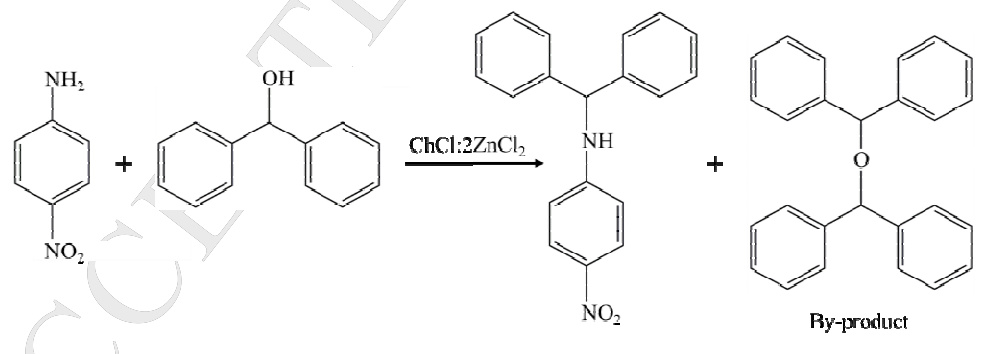  
Fig. 10. Direct nucleophilic substitution reaction of alcohols with 4-nitroaniline in DES.

Preethi et al. [52] employed $\mathbf { C h C l : Z n C l } _ { 2 }$ as the template to synthesize mesoporous titania photocatalysts by a green sol-gel route.The sample prepared using $2 { \mathrm { ~ m L } }$ of DES with $9 \mathrm { m L }$ of titanium tetraisopropoxide possessed uniformly dispersed, spherical particles with an average size of $1 3 . 2 ~ \mathrm { n m }$ and a surface area of $7 5 . 1 ~ \mathrm { m } ^ { 2 } . \mathrm { g } ^ { - 1 }$ . The LADES offers excellent control over the growth of titania particles, and it can be easily removed by washing with ethyl acetate and water.

# 5.1.2 ChCl and SnCl2 based LADES

Azizi et al. [53] introduced different LADES as green and reusable catalysts for electrophilic substitution reactions between indole derivatives and various aldehydes to synthesize bis(indolyl)methane (Fig. 11). As a result, the best performance of $97 \%$ yield was obtained in $\mathrm { C h C l } { : } 2 \mathrm { S n C l } _ { 2 }$ in the presence of 0.3 mL polyethylene glycol. Compared with the previous work, this green and convenient method shows its superiority concerning catalyst, solvent, environmental friendliness, and reaction time.

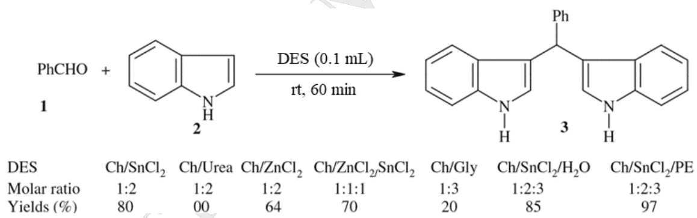  
Fig. 11. Synthesis of bis(indolyl)methane in deep eutectic solvents. (Reprinted with permission from Ref. [53]. Copyright (2012) Springer-Verlag.)

Shahaibi et al. [54] efficiently prepared various quinoline derivatives through a one-pot synthesis using $\mathrm { C h C l } { : } 2 \mathrm { S n C l } _ { 2 }$ as a green catalyst and solvent. In the presence of DES, aniline derivatives, aromatic aldehydes and enolizable aldehydes were mixed at $6 0 ~ ^ { \circ } \mathrm { C }$ for 2 to $3 \mathrm { ~ h ~ }$ . As a result, high yield of quinoline derivatives can be reached from $54 \%$ to $97 \%$ ... The LADES can be successfully reused for 4 times while almost

keep it initial catalytic effect.

  
Fig. 12. One-pot synthesis of quinoline derivatives using $\mathrm { C h C l } { : } 2 \mathrm { S n C l } _ { 2 }$ .

# 5.1.3 ChCl and ZnBr2 based LADES

Cheng et al. [55] firstly investigated the LADES composed of ChCl and $\mathrm { Z n B r } _ { 2 }$ to catalyze  the reaction between epoxides and $\mathbf { C O } _ { 2 }$ to form cyclic carbonates under solvent-free conditions (Fig. 13). The reaction conditions were optimized to $5 { \mathrm { C h C l } } { \mathrm { : } } Z { \mathrm { n B r } } _ { 2 }$ , $1 1 0 ~ ^ { \circ } \mathrm { C }$ , 60 min, 1.5 MPa, and $9 5 \substack { - 1 0 0 \% }$ yield of propylene carbonate was reached. The catalyst can be recycled for five times without loss of catalytic activity. They also proposed the tentative mechanism. The bromine anion opens the epoxy ring, which is synergistically activated by $Z \mathrm { n } ^ { 2 + }$ and -OH of ChCl to produce the intermediate. Then, the intermediate reacts with $\mathbf { C O } _ { 2 }$ to form the corresponding cyclic carbonate and regenerate the catalyst.

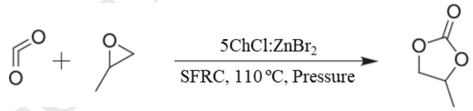  
Fig. 13. Cyclic carbonates from $\mathrm { C O } _ { 2 }$ and epoxides using $5 { \mathrm { C h C l } } { \cdot } { \mathrm { Z n B r } } _ { 2 }$ .

# 5.2 Applications of Type $\boxed { \begin{array} { r l } \end{array} }$ LADES

# 5.2.1 ChCl and $C r C l _ { 3 } { \cdot } 6 H _ { 2 } O$ based LADES

Cao et al. [56] applied a variety of LADES including ChCl:2MCl $( \mathbf { M } = \mathrm { F e }$ , Zn and Sn) and ChCl:2MCl· $_ { \mathrm { H } _ { 2 } \mathrm { O } }$ $( \mathbf { M } = \mathbf { M } \mathbf { g } $ , Al, Cr, Mn, Co, Ni and Cu) to investigate their performance on the esterification of n-butyl acetate. From Table 5, $\mathrm { C h C l } { : } 2 \mathrm { C r } { \mathrm { C l } _ { 3 } } { \cdot } 6 \mathrm { H } _ { 2 } { \mathrm { O } }$ has the highest activity to produce n-butyl acetate with the yield of $93 \%$ at room temperature. The LADES ChCl: $\mathsf { 2 C r C l } _ { 3 }$ · $6 \mathrm { H } _ { 2 } \mathrm { O }$ exhibits excellent catalytic effect and high product selectivity.

Abbott et al. [14] demonstrated the electrodeposition of thick, adherent, crack-free chromium films from the LADES ChCl:2CrCl· $6 \mathrm { H } _ { 2 } \mathrm { O }$ (Fig. 14), where the crystal waters are highly coordinated to the chrome center or associated with the free chloride ions. Although the hardness of 242 Vickers for the film was less than the chrome hydride produced by the chromic acid process of typically 800 to 900 Vickers, it was greater than pure chromium of typically 220 Vickers. It turned out that the chromium(III)containing LADES was applicable to replace  hexavalent chrome baths for the deposition of crackfree chromium coatings. Besides, it was found that the addition of LiCl to ChCl:2CrCl·6H2O could benefit the deposition of crack free, nanocrystalline black chromium films that possess good corrosion resistance [57].

Table 7. Synthesis of n-butyl acetate using different LADES. (Reprinted with permission from Ref. [56]. Copyright (2016) Royal Society of Chemistry.)   

<html><body><table><tr><td>Entry</td><td>DES</td><td>Yield of n-butyl acetate</td><td>Selectivity to n-butyl acetate</td></tr><tr><td>1</td><td>ChCl:2CrCl3·6H2O</td><td>93.0%</td><td>100%</td></tr><tr><td>2</td><td>ChCl:2FeCl3</td><td>64.5%</td><td>100%</td></tr><tr><td>3</td><td>ChC:2AlCl3:6H2O</td><td>49.1%</td><td>100%</td></tr><tr><td>4</td><td>ChCl:2MgCl2·6H2O</td><td>18.0%</td><td>100%</td></tr><tr><td>5</td><td>ChCl:2MnCl:4H2O</td><td>6.3%</td><td>100%</td></tr><tr><td>6</td><td>ChCl:2CoCl:6H2O</td><td>7.8%</td><td>100%</td></tr><tr><td>7</td><td>ChCl:2NiCl·6H2O</td><td>10.4%</td><td>100%</td></tr><tr><td>8</td><td>ChCl:2CuCl2·2H2O</td><td>3.7%</td><td>100%</td></tr></table></body></html>

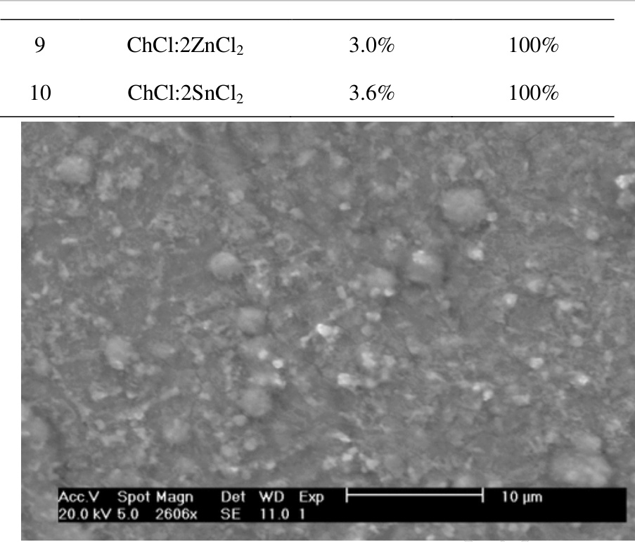

Fig. 14. SEM image of the deposit formed following the electrolysis of $\mathrm { C h C l } { : } 2 \mathrm { C r } { \mathrm { C l } _ { 3 } } { \cdot } 6 \mathrm { H } _ { 2 } \mathrm { O }$ system at $6 0 ~ ^ { \circ } \mathrm { C }$ for 2 hours onto a nickel electrode at a current density of $0 . 3 4 5 \mathrm { \ m A } / \mathrm { c m } ^ { 2 }$ (bar ${ \tt = } 1 0 \ { \mu \mathrm { m } } ,$ ). (Reprinted with permission from Ref. [14]. Copyright (2004) Wiley-VCH.)

# 5.2.2 [EMIM][OAc] and $\mathrm { F e C l } _ { 3 }$ · $6 \mathrm { H } _ { 2 } \mathrm { O }$ based LADES

Choi et al. [75] developed a efficient lipid extraction method from Chlorella vulgaris by LADES composed of 1-ethyl-3-methyl imidazolium acetate ([EMIM][OAc]) and FeCl3· $6 \mathrm { H } _ { 2 } \mathrm { O }$ . The lipid extraction yields of the single $\mathrm { F e C l } _ { 3 }$ · $6 \mathrm { H } _ { 2 } \mathrm { O }$ and [EMIM][OAc] are 113.0 and $2 1 8 . 7 \mathrm { m g / g }$ , respectively. However, the lipid extraction yield can rise up to $2 2 7 . 6 \mathrm { \ m g / g }$ when mixing $\mathrm { F e C l } _ { 3 } { \cdot } 6 \mathrm { H } _ { 2 } \mathrm { O }$ with [EMIM][OAc] in a weight ratio of 5:1 within $^ { \textrm { 1 h } }$ at $9 0 ~ ^ { \circ } \mathrm { C }$ , where the high fatty acid content of $9 8 1 . 7 ~ \mathrm { m g / g }$ lipid indicates the very low amounts of impurity less than $2 \%$ . The extraction mechanism was investigated to conclude that the synergistic effects of two potent chloride and acetate anions contributed to the enhancement of extraction

yield.

# 5.3 Applications of Type $\boxed { \begin{array} { r l } \end{array} }$ LADES

# 5.3.1 ZrOCl2·8H2O and urea based LADES

Shaibuna et al. [58] synthesized three LADES by mixing $\mathrm { Z r O C l } _ { 2 }$ · ${ \mathrm { 8 H } } _ { 2 } \mathrm { O }$ with urea, ethylene glycol or glycerol. The DES $\mathrm { Z r O C l } _ { 2 }$ · $8 \mathrm { H } _ { 2 } \mathrm { O } { : } 5$ urea possess the lowest density, viscosity, highest acidity and thermal stability, which was selected to catalyze the Paal-Knorr reaction at room temperature with a high efficiency and good product yield in short reaction time (Fig. 15). Simple, environmentally benign and solvent-free conditions make this method worthy of attention to prepare pyrroles.

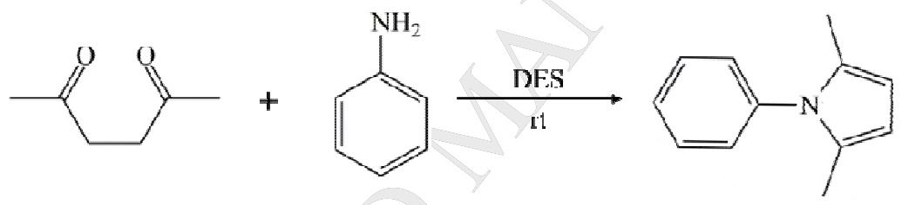  
Fig. 15. Paal-Knorr reaction catalyzed by DES at room temperature.

# $5 . 3 . 2 Z n C l _ { 2 }$ and urea based LADES

Lian et al. [59] first proposed a greener and more efficient approach to lignin modification, thereby optimizing its structural performance as a phenol-formaldehyde resin filler. The optimal LADES is prepared by $\mathrm { Z n C l } _ { 2 }$ and urea with the mole ratio of 3:10, which results in the best lignin solvation. With the treatment of $3 \mathrm { Z n C l } _ { 2 }$ :10urea, the weight of lignin recovered is 4 times of original lignin, suggesting that the structure of lignin is transformed through the integration of $Z \mathrm { n }$ , thus to enhance the lignin’s reactivity towards the formation of phenol-formaldehyde resin.

# $5 . 3 . 3 \ : C r C l _ { 3 } { \cdot } 6 H _ { 2 } O$ and urea based LADES

Abbott et al [60] investigated the chromium electrodeposition from a type  LADES of $2 \mathrm { C r } \mathrm { C l } _ { 3 }$ · $6 \mathrm { H } _ { 2 } \mathrm { O }$ :urea. The process proceeds via a 1 electron transfer $( \mathrm { C r } ^ { 3 + } / { } ^ { 2 + } )$ followed by a 2 electron reduction to the metal. Deposition onto gold is electrochemically reversible and the reduction process had a high current efficiency despite the hydrate water molecules present. Thick, adherent, non-cracked chromium could be bulk-deposited onto steel. The coating hardness values of approximately 600 ± 10 Vickers could be achieved, which is much higher than that from ChCl:2CrCl· $6 \mathrm { H } _ { 2 } \mathrm { O }$ (242 Vickers), indicating that this liquid is capable of producing hard chromium coatings.

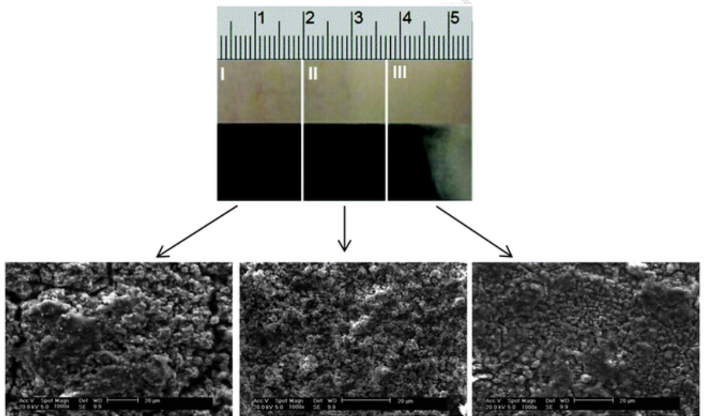

Fig. 16. Chromium electrodeposit obtained using a Hull cell and the 2CrCl3·6H2O:urea DES (current densities: $\mathrm { I } = 0 . 2 2$ , $\mathrm { I I } = 0 . 1 7$ and $\mathrm { I I I } = 0 . 1 1 \mathrm { A c m } ^ { - 2 } .$ ) (Reprinted with permission from Ref. [59]. Copyright (2014) Royal Society of Chemistry.)

# 6. Conclusion and outlook

DES have aroused increasing scientific attention in the past decade, where the ADES is an important branch. This review provides a brief insight into the synthesis, properties and applications of ADES. Compared with AILs, ADES exhibit their superiority because of (1) convenient preparation with high atom economy, (2) low cost owing to the readily accessible raw materials, (3) flexible designability to prepare the task-specific ADES, (4) low toxicity and biodegradability, especially the ADES derived from ChCl and renewable chemicals.

The challenges of applying ADES for green processes provide opportunities for future research. There is an urgent need for research in areas involving solvent effect and mechanism, task-specific and functionalized design, and intensified and tunable reaction and separation process development involving DES:

(1) For a specific reaction or separation task, the molecular interaction between HBD and HBA with the system components is important, which can help us to figure out the relationship of DES structure and process performance. Specially, for reactions requiring special solvent effect and for hard-to-separate mixtures, the design methodology is very helpful and strongly needed, which is more effective and targeted. For this purpose, the developed multi-scale methodology of computer-aided design could be extended [64-68].

(2) Currently, the appeared ADES are limited and many of them are confined to ChCl. More HBD and HBA candidates and even bifunctional or multifunctional group can be considered.

(3) Application of ADES for wider fields of reaction and separation processes.

They may replace the traditional organic solvents and catalysts and play as dual functional solvents; and they can act as both electrolyte and catalyst in electrochemistry reaction. For separation systems, the advantage of DES formation selectively with the desired component of mixture is very useful to recover the product.

(4) Despite the fact that the individual components of ADES tend to be well toxicologically characterized, we know little about the toxicological properties of the resultant ADES themselves. The comprehensive investigation of the toxicity and biodegradability of ADES are necessary to ensure their green affiliation.

# Acknowledgement

The financial support from National Natural Science Foundation of China (21776074, 21576081, and 2181101120) is greatly acknowledged.

# References

[1] M. Francisco, d.B.A. Van, M.C. Kroon, Angew. Chem., Int. Ed. Engl. 52 (2013) 3074-3085.   
[2] B. Kudłak, J. Namieśnik, K. Owczarek, Environ. Sci. Pollut. Res. 22 (2015) 11975-11992.   
[3] J. Wang, J. Luo., S. Feng, H. Li, Y. Wan, X. Zhang, Green Energ Environ. 1 (2016) 43-61.   
[4] J. Gorke, F. Srienc, R. Kazlauskas, Biotechnol. Bioprocess Eng. 15 (2010) 40-53.

[5] Y. Ke, W. Jin, Q.W. Yang, X. Suo, Y. Yang, Q.L. Ren, H.B. Xing, ACS Sustainable Chem. Eng. 6 (2018) 8983-8991.   
[6] K. Dong, X. Liu, H. Dong, X. Zhang, S. Zhang, Chem. Rev. 117 (2017) 6636-6695.   
[7] Q. Zhang, K.D.O. Vigier, S. Royer, F. Jerome, Chem. Soc. Rev. 41 (2012) 7108-7146.   
[8] Y. Xie, H. Dong, S. Zhang, X. Lu, X. Ji, Green Energy Environ. 1 (2016) 195-200.   
[9]  E.L. Smith, A.P. Abbott, K.S. Ryder, Chem. Rev. 114 (2014) 11060-11082.   
[10] Y. Cui, C. Li, J. Yin, S. Li, Y. Jia, M. Bao, J. Mol. Liq. 236 (2017) 338-343.   
[11] A.P. Abbott, G. Capper, D.L. Davies, R.K. Rasheed, V. Tambyrajah, Chem. Commun. 1 (2003) 70-71.   
[12]C. Florindo, F.S. Oliveira, L.P.N. Rebelo, A.M. Fernandes, I.M. Marrucho, ACS Sustainable Chem. Eng. 2 (2014) 2416-2425.   
[13]A.P. Abbott, D Boothby, G Capper, D.L. Davies, R.K. Rasheed,  J. Am. Chem. Soc. 126 (2004) 9142-9147.   
[14]A.P. Abbott, G. Capper, D.L. Davies, R.K. Rasheed, Chem-Eur. J. 10 (2004) 3769-3774.   
[15]H Qin, Z Song, Q Zeng, H.Y Cheng, L.F. Chen, Z.W. Qi. AIChE J. (2018) DOI: 10.1002/aic.16472.   
[16]S. Khandelwal, Y.K. Tailor, M. Kumar, J. Mol. Liq. 215 (2016) 345-386.   
[17]Z. Maugeri, P.D. de María, RSC Adv. 2 (2012) 421-425.

[18]A.P. Abbott, G. Capper, D.L. Davies, H.L. Munro, R.K. Rasheed, V. Tambyrajah, Chem. Commun. 19 (2001) 2010-2011.

[19]A.P. Abbott, G. Capper, D.L. Davies, R. Rasheed, Inorg. Chem. 43 (2004) 3447-3452.   
[20] H. Wang, Y. Jing, X. Wang, Y. Yao, Y. Jia, J. Mol. Liq. 163 (2011) 77-82.   
[21] A.P. Abbott, J.C. Barron, K.S. Ryder, D. Wilson, Chem-Eur J. 13 (2007) 6495-6501.   
[22] A.P. Abbott, A.A. Al-Barzinjy, A.A. Abbott, P.D. Frisch, G. Harris, R.C. Hartley, K.S. Ryder, Phys. Chem. Chem. Phys. 16 (2014) 9047-9055.   
[23] M. Shaibuna, L.V. Theresa, K. Sreekumar, Catal. Lett. (2018) 1-14.   
[24] R. Kore, R. Srivastava, J. Mol. Catal. A: Chem. 345 (2011) 117-126.   
[25] Y.L. Yang, Y. Kou, Chem. Commun. 2 (2004) 226-227.   
[26] E.P. Parry, J. Catal. 2 (1963) 371-379.   
[27] M.B. Taysun, E. Sert, F.S. Atalay, J. Mol. Liq. 223 (2016) 845-852.   
[28] Z. Duan, Y. Gu, Y. Deng. Catal. Commun. 7 (2006) 651-656.   
[29] J. Jacquemin, P. Husson, A.A. Padua, V. Majer, Green Chem. 8 (2006) 172-180.   
[30] L. Glasser, Thermochim. Acta. 421 (2004) 87-93.   
[31] M.B. Taysun, E. Sert, F.S. Atalat, J. Chem. Eng. Data. 62 (2017) 1173-1181.   
[32] A.P. Abbott, G. Capper, S. Grat, Chemphyschem. 7 (2006) 803-806.   
[33] M. Hayyan, T. Aissaoui, M.A. Hashim, M.A. AlSaadi, A. Hayyan, J. Taiwan Inst. Chem. Eng. 50 (2015) 24-30.   
[34] C. Schreiner, S. Zugmann, R. Hartl, H.J. Gores, J. Chem. Eng. Data. 55 (2010)

1784-1788. [35] J.P. Belieres, C.A. Angell, J. Phys. Chem. B. 111 (2007) 4926-4937. [36] C.A. Angell, N. Byrne, J.P. Belieres, Accounts Chem. Res. 40 (2007) 1228-1236. [37] A.P. Abbott, G. Frish, J. Hartley, K.S. Ryder, Green Chem. 13 (2011) 471-481. [38]. A.P. Abbott, G. Capper, D.L. Davies, K.J. McKenzie, S.U. Obi, J. Chem. Eng. Data. 51 (2006) 1280-1282. [39] A. Biswas, R.L. Shogren, D.G. Stevenson, J.L. Willett, P.K. Bhowmik, Carbohyd Polym. 66 (2006) 546-550. [40] H.G. Morrsion, C.C Sun, S. Neervannan, Int. J. Pharmaceut. 378 (2009) 136-139. [41] J. Li, Z. Han, Y. Zou, B. Yu, RSC Adv. 5 (2015) 93937-93944. [42] T. Bosiljkov, F. Dujmić, M.C. Bubalo, J. Hribar, R. Vidrih, M. Brnčić, E. Zlatic, I.R. Redovniković, S. Jokić, Food Bioprod. Process. 102 (2017) 195-203. [43] J. Yin, J. Wang, Z. Li, D. Li, G. Yang, Y. Cui, A. Wang, C. Li, Green. Chem. 17 (2015) 4552-4559. [44] J. Li, H. Xiao, X. Tang, M. Zhou, Energ. Fuel. 30 (2016) 5411-5418. [45] L. Ding, W. Yang, L. Chen, H. Cheng, Z. Qi, Catal. Today. (2018) https://doi.org/10.1016/j.cattod.2018.04.069. [46] A.A. Assanosi, M.M. Farah, J. Wood, B. Al-Duri, RSC Adv. 4 (2014) 39359-39364. [47] S. Hu, Z. Zhang, Y. Zhou, J. Song, H. Fan, B. Han, Green. Chem. 11 (2009) 873-877. [48] Q. Zeng, H. Qin, H.Y. Cheng, L.F. Chen, Z.W. Qi, Chem. Eng. Sci. (2018)

[49] V.D. Santi, F. Cardellini, L. Brinchi, R. Germani, Tetrahedron Lett. 53 (2012) 5151-5155.   
[50] J.D. Mota-Morales, M.C. Gutiérrez, I.C. Sanchez, G. Luna-Bárcenas, F. del Monte, Chem. Commun. 47 (2011) 5328-5330.   
[51] A. Zhu, L. Li, J. Wang, K. Zhuo, Green. Chem. 13 (2011) 1244-1250.   
[52] T. Preethi, M.P. Padmapriya, B. Abarna, G.R. Rajarajeswari, RSC Adv. 7 (2017) 10081-10091.   
[53] N. Azizi, Z. Manocheri, Res. Chem. Intermediat. 38 (2012) 1495-1500.   
[54] D. Shahabi, H. Tavakol, J. Mol. Liq. 220 (2016) 324-328.   
[55] W. Cheng, Z. Fu, J. Wang, J. Sun, S. Zhang, Synthetic Commun. 42 (2012) 2564-2573.   
[56] J. Cao, B. Qi, J. Liu, Y. Shang, H. Liu, W. Wang, J. Lv, Z. Chen, H. Zhang, X. Zhou, RSC Adv. 6 (2016) 21612-21616.   
[57] A.P. Abott, G. Capper, D.L.Davies, R.K. Rasheed, J. Archer, C. John, T. I. Met. Finish. 82 (2004) 14-17.   
[58] M. Shaibuna, L.V. Theresa, K. Sreekumar. Catal. Lett. (2018) 1-14.   
[59] H. Lian, S. Hong, A. Carranza, J.D. Mota-Morales, J.A. Pojman, RSC Adv. 5 (2015) 28778-28785.   
[60] A.P. Abbott, A.A. Al-Barzinjy, P.D. Abbott, G. Frisch, R.C. Harris, J. Hartley, K.S. Ryder, Phys. Chem. Chem. Phys. 16 (2014) 9047-9055.   
[61] A. Hayyan, M.A. Hashim, F.S. Mjalli, M. Hayyan, I.M. AlNashef, Chem. Eng. Sci. 92 (2013) 81-88.   
[62] C. Mao, R. Zhao, X. Li, X. Gao, RSC Adv. 7 (2017) 12805-12811.   
[63] F. Liu, Z. Xue, X. Zhao, H. Mou, J. He, T. Mu, Chem. Commun. (2018) DOI: 10.1039/c8cc03798a.   
[64] Z. Song, C.Y. Zhang, Z.W. Qi, T. Zhou, K. Sundamacher, AIChE. J. 64 (2018) 1013-1025.   
[65] Z. Song, T. Zhou, Z.W. Qi, K. Sundmacher, ACS Sustain. Chem & Eng. 5 (2017) 3382-3389.   
[66]J.N. Zhang, D.L. Peng, Z. Song, H.Y. Cheng, L.F. Chen, Z.W. Qi, Chem. Eng. Sci. 162 (2017) 355-363.   
[67]J.N. Zhang, L. Qin, D.L. Peng, H.Y. Cheng, L.F. Chen, Z.W. Qi, Chem. Eng. Sci. 162 (2017) 364-374.   
[68] J.W. Wang, Z. Song, H.Y. Cheng, L.F. Chen, L.Y. Deng, Z.W. Qi, ACS Sustain. Chem. Eng. 6 (2018) 12025-12035.   
[69] Z. Song, X. Li, H. Chao, F. Mo, T. Zhou, H.Y. Cheng, Z.W. Qi, Green Energy & Environ. (2018) https://doi.org/10.1016/j.gee.2018.12.001.   
[70] Z. Song, T. Zhou, J.N. Zhang, H.Y. Cheng, L.F. Chen, Z.W. Qi, Chem. Eng. Sci. 129 (2015) 69-77.   
[71] M.C. Gutiérrez, M.L. Ferrer, C.R. Mateo, F. del Monte, Langmuir, 25 (2009), 5509-5515.   
[72] H.W. Ren, C.M. Chen, S.H. Guo, D.S. Zhao, Q.H. Wang, Bioresources. 11 (2016) 8457-8469.   
[73] E.A. Drylie, D.S. Wragg, E.R. Parnham, P.S. Wheatley, A.M. Slawin, J.E. Warren,

R.E. Morris, 119 (2007) 7985-7989.

[74] L. Liu, S. Ferdov, C. Coelho, Y. Kong, L. Mafra, J.P. Li, J. Rocha, Inorganic Chem. 48 (2009), 4598-4600.

[75] S.A. Choi, J.S. Lee, Y.K. Oh, M.J. Jeong, S.W. Kim, J.Y. Park, Algal Res. 3 (2014) 44-48.

# Abbreviations

ADES: acidic deep eutectic solvent   
BADES: Brønsted acidic deep eutectic solvent   
LADES: Lewis acidic deep eutectic solvent   
IL: ionic liquid   
AIL: acidic ionic liquids   
HBA: hydrogen bond acceptor   
HBD: hydrogen bond donor   
ChCl: choline chloride   
BTEAC: benzyl triethylammonium chloride   
BTMAC: benzyl tri-methyl ammonium chloride   
ATPPB: Allyltriphenylphosphonium bromide   
TBAC: tetrabutylammonium chloride   
TEAC: tetraethylammonium chloride   
TBAB: tetrabutylammonium bromide   
TEAB: tetraethylammonium bromide   
PTSA: $p$ -toluenesulfonic acid   
OX: oxalic acid   
CA: citric acid   
TCA: trichloroacetic acid   
MCA: monochloroacetic acid   
PA: propionic acid   
AA: acrylic acid   
MAA: methacrylic acid   
PPA: phenylpropionic acid   
PAA: phenylacetic acid   
IBAc: isobutyric acid   
Im: imidazole   
5-HMF: 5-hydroxymethylfurfural   
IBOH: isobutanol   
IBIBE: isobutyl isobutyrate   
FPs: frontal polymerizations   
CoAlPO: cobalt aluminophosphate   
[ATEAm]Cl: ally triethyl ammounium chloride

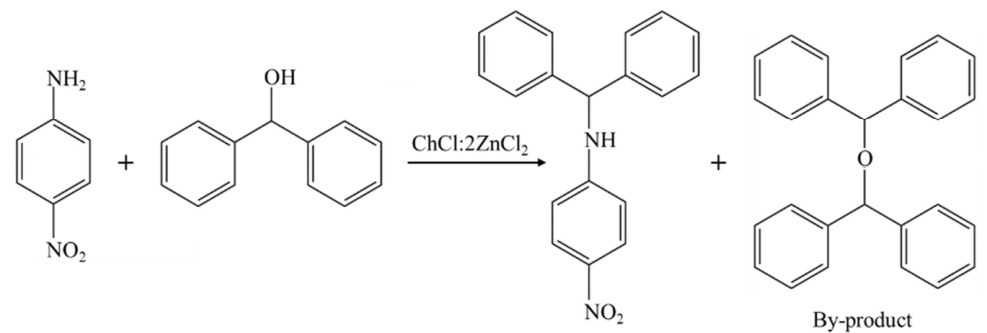  
Fig. 9. Direct nucleophilic substitution reaction of alcohols with 4-nitroaniline in DES.